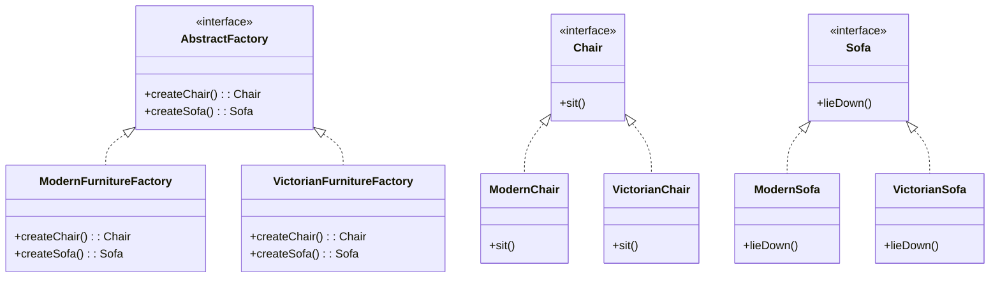

# Teoría
## Definición

El **patrón Abstract Factory** (Fábrica abstracta) es un patrón creacional que permite **crear familias de objetos relacionados** sin especificar sus clases concretas.
La clave es encapsular el código de creación en fábricas, de manera que el cliente trabaje solo con **interfaces abstractas**, manteniendo compatibilidad y flexibilidad.

## Cuándo usarlo

* Cuando necesitamos **grupos de productos relacionados** (botones, menús, muebles, etc.) que deben funcionar juntos.
* Cuando queremos **evitar acoplamiento** con clases concretas.
* Cuando el sistema debe **cambiar de variantes fácilmente** (ej. estilos moderno/victoriano, Windows/Linux).

## Cuándo no usarlo

* Si solo necesitamos **una familia de objetos** o un único producto.
* Si la creación de objetos no cambia o no hay variantes.
* Cuando el patrón añade **complejidad innecesaria** para casos simples.

---

## Estructura (Mermaid)



---

## Ejemplo en **Spring Boot (Java)**

```java
// Interfaces de productos
public interface Chair {
    void sit();
}

public interface Sofa {
    void lieDown();
}

// Implementaciones concretas
public class ModernChair implements Chair {
    public void sit() { System.out.println("Sentado en una silla moderna."); }
}

public class VictorianChair implements Chair {
    public void sit() { System.out.println("Sentado en una silla victoriana."); }
}

public class ModernSofa implements Sofa {
    public void lieDown() { System.out.println("Acostado en un sofá moderno."); }
}

public class VictorianSofa implements Sofa {
    public void lieDown() { System.out.println("Acostado en un sofá victoriano."); }
}

// Abstract Factory
public interface FurnitureFactory {
    Chair createChair();
    Sofa createSofa();
}

// Fábricas concretas
public class ModernFurnitureFactory implements FurnitureFactory {
    public Chair createChair() { return new ModernChair(); }
    public Sofa createSofa() { return new ModernSofa(); }
}

public class VictorianFurnitureFactory implements FurnitureFactory {
    public Chair createChair() { return new VictorianChair(); }
    public Sofa createSofa() { return new VictorianSofa(); }
}

// Cliente (Spring Boot Service)
@Service
public class FurnitureService {
    private final FurnitureFactory factory;

    public FurnitureService() {
        // Aquí podría decidirse por configuración
        this.factory = new ModernFurnitureFactory();
    }

    public void demo() {
        Chair chair = factory.createChair();
        Sofa sofa = factory.createSofa();
        chair.sit();
        sofa.lieDown();
    }
}
```

---

## Ejemplo en **Django (Python)**

```python
from abc import ABC, abstractmethod

# Interfaces
class Chair(ABC):
    @abstractmethod
    def sit(self): pass

class Sofa(ABC):
    @abstractmethod
    def lie_down(self): pass

# Implementaciones concretas
class ModernChair(Chair):
    def sit(self):
        return "Sentado en una silla moderna"

class VictorianChair(Chair):
    def sit(self):
        return "Sentado en una silla victoriana"

class ModernSofa(Sofa):
    def lie_down(self):
        return "Acostado en un sofá moderno"

class VictorianSofa(Sofa):
    def lie_down(self):
        return "Acostado en un sofá victoriano"

# Abstract Factory
class FurnitureFactory(ABC):
    @abstractmethod
    def create_chair(self) -> Chair: pass

    @abstractmethod
    def create_sofa(self) -> Sofa: pass

# Fábricas concretas
class ModernFurnitureFactory(FurnitureFactory):
    def create_chair(self): return ModernChair()
    def create_sofa(self): return ModernSofa()

class VictorianFurnitureFactory(FurnitureFactory):
    def create_chair(self): return VictorianChair()
    def create_sofa(self): return VictorianSofa()

# Cliente en Django (ejemplo en views.py)
from django.http import JsonResponse

def furniture_demo(request):
    factory = ModernFurnitureFactory()  # Podría cambiarse dinámicamente
    chair = factory.create_chair()
    sofa = factory.create_sofa()
    return JsonResponse({
        "chair": chair.sit(),
        "sofa": sofa.lie_down()
    })
```

---

## Resumen

* Abstract Factory permite **crear familias de productos consistentes** sin acoplar el código a implementaciones concretas.
* Es útil en aplicaciones que necesitan **variantes intercambiables** (ej. estilos, SO, catálogos).
* Se aplica tanto en Java (Spring Boot) como en Python (Django) con interfaces y fábricas concretas.

# Práctica con Spring Boot
## Paso 1: Creación del Proyecto en IntelliJ IDEA 🚀

Primero, vamos a crear un proyecto nuevo y limpio.

1.  Abre IntelliJ IDEA y ve a **File** \> **New** \> **Project...**.

2.  En la ventana que aparece, selecciona **Spring Initializr** en el panel izquierdo.

3.  Configura los metadatos de tu proyecto. Puedes usar estos valores:

      * **Name**: `abstract-factory-ejemplo`
      * **Location**: La carpeta donde quieras guardarlo.
      * **Language**: **Java**
      * **Type**: **Gradle - Groovy** (o Maven si lo prefieres, ambos funcionarán).
      * **Group**: `com.example.solid`
      * **Artifact**: `abstract-factory-ejemplo`
      * **JDK**: Asegúrate de seleccionar la **versión 17** (o superior).
      * **Packaging**: **Jar**

4.  Haz clic en **Next**.

5.  Ahora, elige las dependencias. Para este proyecto, solo necesitas una:

      * Busca y selecciona **Spring Web**.

6.  Haz clic en **Create**. IntelliJ generará la estructura del proyecto y descargará las dependencias.

-----

## Paso 2: Estructura de Paquetes 📂

Una buena organización es clave. Dentro de `src/main/java/com/example/solid/abstractfactoryejemplo`, crearemos los siguientes paquetes para mantener nuestro código ordenado:

  * `products`: Contendrá las interfaces de los productos (ej. `Silla`) y sus implementaciones concretas (ej. `SillaModerna`).
  * `factory`: Contendrá la interfaz de la fábrica abstracta (`MuebleriaFactory`) y sus implementaciones concretas (`MuebleriaModernaFactory`).
  * `controller`: Contendrá nuestro `RestController`, que actuará como el cliente del patrón.

-----

## Paso 3: Codificación del Patrón Abstract Factory 🛋️

Ahora vamos a escribir el código, siguiendo la estructura que definimos.

### 3.1. Productos Abstractos (Interfaces)

Dentro del paquete `products`, crea estas dos interfaces. Serán el contrato para nuestras familias de objetos.

**`Silla.java`**

```java
package com.example.solid.abstractfactoryejemplo.products;

public interface Silla {
    String sentarse();
}
```

**`Sofa.java`**

```java
package com.example.solid.abstractfactoryejemplo.products;

public interface Sofa {
    String recostarse();
}
```

### 3.2. Productos Concretos (Implementaciones)

En el mismo paquete `products`, crea las cuatro clases que implementan las interfaces anteriores. Estos son los objetos reales que construiremos.

**`SillaModerna.java`**

```java
package com.example.solid.abstractfactoryejemplo.products;

public class SillaModerna implements Silla {
    @Override
    public String sentarse() {
        return "Sentado cómodamente en una silla moderna.";
    }
}
```

**`SillaVictoriana.java`**

```java
package com.example.solid.abstractfactoryejemplo.products;

public class SillaVictoriana implements Silla {
    @Override
    public String sentarse() {
        return "Sentado con elegancia en una silla victoriana.";
    }
}
```

**`SofaModerno.java`**

```java
package com.example.solid.abstractfactoryejemplo.products;

public class SofaModerno implements Sofa {
    @Override
    public String recostarse() {
        return "Recostado en un sofá de diseño minimalista.";
    }
}
```

**`SofaVictoriano.java`**

```java
package com.example.solid.abstractfactoryejemplo.products;

public class SofaVictoriano implements Sofa {
    @Override
    public String recostarse() {
        return "Descansando sobre un sofá victoriano de terciopelo.";
    }
}
```

### 3.3. Fábrica Abstracta (Interfaz)

Ahora, en el paquete `factory`, crea la interfaz que define qué productos pueden crear nuestras fábricas.

**`MuebleriaFactory.java`**

```java
package com.example.solid.abstractfactoryejemplo.factory;

import com.example.solid.abstractfactoryejemplo.products.Silla;
import com.example.solid.abstractfactoryejemplo.products.Sofa;

public interface MuebleriaFactory {
    Silla crearSilla();
    Sofa crearSofa();
}
```

### 3.4. Fábricas Concretas (Implementaciones)

En el mismo paquete `factory`, crea las fábricas que saben cómo construir una familia de productos específica (moderna o victoriana). **Las anotamos como `@Component` de Spring** para que el sistema las reconozca y las podamos inyectar después.

**`MuebleriaModernaFactory.java`**

```java
package com.example.solid.abstractfactoryejemplo.factory;

import com.example.solid.abstractfactoryejemplo.products.*;
import org.springframework.stereotype.Component;

@Component("moderna") // Nombre clave para identificar esta fábrica
public class MuebleriaModernaFactory implements MuebleriaFactory {
    @Override
    public Silla crearSilla() {
        return new SillaModerna();
    }

    @Override
    public Sofa crearSofa() {
        return new SofaModerno();
    }
}
```

**`MuebleriaVictorianaFactory.java`**

```java
package com.example.solid.abstractfactoryejemplo.factory;

import com.example.solid.abstractfactoryejemplo.products.*;
import org.springframework.stereotype.Component;

@Component("victoriana") // Nombre clave para esta otra fábrica
public class MuebleriaVictorianaFactory implements MuebleriaFactory {
    @Override
    public Silla crearSilla() {
        return new SillaVictoriana();
    }

    @Override
    public Sofa crearSofa() {
        return new SofaVictoriano();
    }
}
```

-----

## Paso 4: Crear el Cliente (Controlador REST) 🌐

Finalmente, en el paquete `controller`, crearemos la clase que utiliza las fábricas para construir los productos. Usaremos la misma técnica elegante del ejemplo anterior para que Spring nos inyecte todas las fábricas disponibles.

**`MuebleriaController.java`**

```java
package com.example.solid.abstractfactoryejemplo.controller;

import com.example.solid.abstractfactoryejemplo.factory.MuebleriaFactory;
import com.example.solid.abstractfactoryejemplo.products.Silla;
import com.example.solid.abstractfactoryejemplo.products.Sofa;
import org.springframework.beans.factory.annotation.Autowired;
import org.springframework.http.ResponseEntity;
import org.springframework.web.bind.annotation.GetMapping;
import org.springframework.web.bind.annotation.PathVariable;
import org.springframework.web.bind.annotation.RequestMapping;
import org.springframework.web.bind.annotation.RestController;

import java.util.Map;
import java.util.Optional;

@RestController
@RequestMapping("/api/muebles")
public class MuebleriaController {

    // Spring inyecta un mapa con todas las fábricas. La clave es el nombre
    // que pusimos en @Component ("moderna", "victoriana").
    private final Map<String, MuebleriaFactory> factories;

    @Autowired
    public MuebleriaController(Map<String, MuebleriaFactory> factories) {
        this.factories = factories;
    }

    @GetMapping("/crear/{estilo}")
    public ResponseEntity<?> crearMuebles(@PathVariable String estilo) {
        // Buscamos la fábrica correcta según el "estilo" de la URL.
        MuebleriaFactory factory = factories.get(estilo);

        if (factory == null) {
            return ResponseEntity.badRequest().body("Estilo de mueblería no disponible: " + estilo);
        }

        // Usamos la fábrica para crear la familia de productos.
        Silla silla = factory.crearSilla();
        Sofa sofa = factory.crearSofa();

        // Creamos una respuesta con los mensajes de los productos creados.
        Map<String, String> response = Map.of(
            "silla", silla.sentarse(),
            "sofa", sofa.recostarse(),
            "fabrica_usada", factory.getClass().getSimpleName()
        );

        return ResponseEntity.ok(response);
    }
}
```

-----

## Paso 5: Probar la Aplicación ✅

¡Todo está listo\!

1.  Ejecuta tu aplicación desde la clase principal `AbstractFactoryEjemploApplication`.
2.  Usa un navegador o una herramienta como Postman para probar los siguientes endpoints:

<!-- end list -->

  * **Para obtener muebles modernos:**
    `http://localhost:8080/api/muebles/crear/moderna`

    **Respuesta esperada (JSON):**

    ```json
    {
        "silla": "Sentado cómodamente en una silla moderna.",
        "sofa": "Recostado en un sofá de diseño minimalista.",
        "fabrica_usada": "MuebleriaModernaFactory"
    }
    ```

  * **Para obtener muebles victorianos:**
    `http://localhost:8080/api/muebles/crear/victoriana`

    **Respuesta esperada (JSON):**

    ```json
    {
        "silla": "Sentado con elegancia en una silla victoriana.",
        "sofa": "Descansando sobre un sofá victoriano de terciopelo.",
        "fabrica_usada": "MuebleriaVictorianaFactory"
    }
    ```

  * **Para un estilo no existente:**
    `http://localhost:8080/api/muebles/crear/rustica`

    **Respuesta esperada:**
    `Estilo de mueblería no disponible: rustica`

# Práctica con Django
## Paso 1: Creación del Proyecto en PyCharm 🚀

Primero, vamos a crear un proyecto Django nuevo y limpio.

1.  Abre **PyCharm** (versión Professional) y ve a **File** \> **New** \> **Project...**.
2.  En la ventana que aparece, selecciona **Django** en el panel izquierdo.
3.  Configura tu proyecto:
      * **Location**: Elige una carpeta y nombra el proyecto, por ejemplo, `abstract_factory_django`.
      * **New environment using**: Selecciona **Virtualenv**. Esto creará un entorno virtual aislado para tu proyecto.
      * **Application name**: Puedes nombrar tu primera aplicación `core`.
4.  Haz clic en **Create**. PyCharm configurará el entorno, instalará Django y generará la estructura básica del proyecto.

-----

## Paso 2: Estructura de Archivos y Aplicación Django 📂

En Django, la lógica se organiza en "apps". Crearemos una app específica para nuestra mueblería.

1.  Abre la **Terminal** dentro de PyCharm (**View** \> **Tool Windows** \> **Terminal**).
2.  Ejecuta el siguiente comando para crear una nueva app llamada `muebleria`:
    ```bash
    python manage.py startapp muebleria
    ```
3.  Ahora, registra esta nueva app en tu proyecto. Abre el archivo `abstract_factory_django/settings.py` y añade `'muebleria'` a la lista de `INSTALLED_APPS`:
    ```python
    # abstract_factory_django/settings.py
    INSTALLED_APPS = [
        # ... otras apps
        'django.contrib.staticfiles',
        'muebleria', # Añade tu app aquí
    ]
    ```

Dentro de la carpeta `muebleria`, organizaremos nuestro patrón en diferentes archivos: `products.py`, `factories.py`, y modificaremos `views.py`.

-----

## Paso 3: Codificación del Patrón Abstract Factory 🛋️

Ahora vamos a escribir el código Python. Usaremos el módulo `abc` para crear clases abstractas, que es el equivalente a las interfaces de Java para este propósito.

### 3.1. Productos Abstractos

1.  Dentro de la carpeta `muebleria`, crea un nuevo archivo llamado `products.py`.

2.  Añade el siguiente código con las clases base para nuestros productos:

    **`muebleria/products.py`**

    ```python
    from abc import ABC, abstractmethod

    # Producto Abstracto 1
    class Silla(ABC):
        @abstractmethod
        def sentarse(self) -> str:
            pass

    # Producto Abstracto 2
    class Sofa(ABC):
        @abstractmethod
        def recostarse(self) -> str:
            pass

    # --- Implementaciones de la familia Moderna ---

    class SillaModerna(Silla):
        def sentarse(self) -> str:
            return "Sentado cómodamente en una silla moderna."

    class SofaModerno(Sofa):
        def recostarse(self) -> str:
            return "Recostado en un sofá de diseño minimalista."

    # --- Implementaciones de la familia Victoriana ---

    class SillaVictoriana(Silla):
        def sentarse(self) -> str:
            return "Sentado con elegancia en una silla victoriana."

    class SofaVictoriano(Sofa):
        def recostarse(self) -> str:
            return "Descansando sobre un sofá victoriano de terciopelo."
    ```

### 3.2. Fábricas (Abstracta y Concretas)

1.  Dentro de la carpeta `muebleria`, crea otro archivo nuevo llamado `factories.py`.

2.  Añade el siguiente código para definir las fábricas:

    **`muebleria/factories.py`**

    ```python
    from abc import ABC, abstractmethod
    from .products import (
        Silla, Sofa,
        SillaModerna, SofaModerno,
        SillaVictoriana, SofaVictoriano
    )

    # La Fábrica Abstracta
    class MuebleriaFactory(ABC):
        @abstractmethod
        def crear_silla(self) -> Silla:
            pass

        @abstractmethod
        def crear_sofa(self) -> Sofa:
            pass

    # Fábrica Concreta 1: para muebles modernos
    class MuebleriaModernaFactory(MuebleriaFactory):
        def crear_silla(self) -> Silla:
            return SillaModerna()

        def crear_sofa(self) -> Sofa:
            return SofaModerno()

    # Fábrica Concreta 2: para muebles victorianos
    class MuebleriaVictorianaFactory(MuebleriaFactory):
        def crear_silla(self) -> Silla:
            return SillaVictoriana()

        def crear_sofa(self) -> Sofa:
            return SofaVictoriano()
    ```

-----

## Paso 4: Crear el Cliente (La Vista de Django) 🌐

El "cliente" en Django será una vista que recibe la petición HTTP, elige la fábrica correcta y devuelve una respuesta JSON.

Modifica el archivo `muebleria/views.py`.

**`muebleria/views.py`**

```python
from django.http import JsonResponse
from .factories import MuebleriaModernaFactory, MuebleriaVictorianaFactory

# Un mapa para registrar nuestras fábricas disponibles.
FABRICAS = {
    "moderna": MuebleriaModernaFactory,
    "victoriana": MuebleriaVictorianaFactory,
}

def crear_muebles(request, estilo: str):
    """
    Esta vista actúa como el cliente del patrón Abstract Factory.
    """
    # 1. Busca la clase de la fábrica correcta.
    fabrica_class = FABRICAS.get(estilo)

    if not fabrica_class:
        return JsonResponse({"error": f"Estilo de mueblería no disponible: {estilo}"}, status=400)

    # 2. Instancia la fábrica seleccionada.
    fabrica = fabrica_class()

    # 3. Usa la fábrica para crear la familia de productos.
    silla = fabrica.crear_silla()
    sofa = fabrica.crear_sofa()

    # 4. Construye y devuelve la respuesta.
    response_data = {
        "silla": silla.sentarse(),
        "sofa": sofa.recostarse(),
        "fabrica_usada": fabrica.__class__.__name__
    }
    return JsonResponse(response_data)
```

-----

## Paso 5: Configurar las URLs 🔗

Necesitamos decirle a Django qué URL debe activar nuestra vista.

1.  Dentro de la carpeta `muebleria`, crea un nuevo archivo `urls.py`.

    **`muebleria/urls.py`**

    ```python
    from django.urls import path
    from . import views

    urlpatterns = [
        path('crear/<str:estilo>/', views.crear_muebles, name='crear_muebles'),
    ]
    ```

2.  Ahora, incluye estas URLs en el archivo principal del proyecto.

    **`abstract_factory_django/urls.py`**

    ```python
    from django.contrib import admin
    from django.urls import path, include # Asegúrate de importar "include"

    urlpatterns = [
        path('admin/', admin.site.urls),
        path('api/muebles/', include('muebleria.urls')), # Conecta las URLs de tu app
    ]
    ```

-----

## Paso 6: Probar la Aplicación ✅

¡Todo está configurado\!

1.  En la terminal de PyCharm, ejecuta el servidor de desarrollo de Django:
    ```bash
    python manage.py runserver
    ```
2.  Usa un navegador o `curl` para probar los siguientes endpoints:

<!-- end list -->

  * **Para obtener muebles modernos:**
    `http://127.0.0.1:8000/api/muebles/crear/moderna/`

    **Respuesta esperada (JSON):**

    ```json
    {
        "silla": "Sentado cómodamente en una silla moderna.",
        "sofa": "Recostado en un sofá de diseño minimalista.",
        "fabrica_usada": "MuebleriaModernaFactory"
    }
    ```

  * **Para obtener muebles victorianos:**
    `http://127.0.0.1:8000/api/muebles/crear/victoriana/`

    **Respuesta esperada (JSON):**

    ```json
    {
        "silla": "Sentado con elegancia en una silla victoriana.",
        "sofa": "Descansando sobre un sofá victoriano de terciopelo.",
        "fabrica_usada": "MuebleriaVictorianaFactory"
    }
    ```

  * **Para un estilo no existente:**
    `http://127.0.0.1:8000/api/muebles/crear/rustica/`

    **Respuesta esperada (JSON con código 400):**

    ```json
    {
        "error": "Estilo de mueblería no disponible: rustica"
    }
    ```