# Patrón de Diseño **Builder (Constructor)**

El **patrón Builder** es un patrón **creacional** que permite construir **objetos complejos paso a paso**. En lugar de tener constructores gigantes o muchas subclases para cada configuración, Builder separa la **lógica de construcción** del **objeto final**.

---

## Idea principal

* Permite **crear diferentes representaciones** de un objeto usando el **mismo proceso de construcción**.
* El cliente no necesita conocer los detalles internos del objeto.
* Aísla el proceso de construcción (director) del producto final (objeto).

---

## Estructura del patrón


---

## Ejemplo en Spring Boot (Java)

En Spring Boot, el patrón **Builder** se usa frecuentemente para crear objetos inmutables o con muchas propiedades opcionales.

```java
@Builder
public class User {
    private String name;
    private String email;
    private int age;
}
```

Uso:

```java
User user = User.builder()
                .name("Ángel")
                .email("angel@example.com")
                .age(21)
                .build();
```

Spring usa internamente **Lombok Builder** para generar un **constructor fluido**, evitando constructores largos.

---

## Ejemplo en Django (Python)

En Django, el patrón Builder puede aplicarse al **creador de objetos de modelos**, cuando se requiere construir instancias complejas antes de guardarlas.

```python
class UserBuilder:
    def __init__(self):
        self._data = {}

    def with_name(self, name):
        self._data["name"] = name
        return self

    def with_email(self, email):
        self._data["email"] = email
        return self

    def build(self):
        return User(**self._data)

# Uso
builder = UserBuilder()
user = builder.with_name("Ángel").with_email("angel@example.com").build()
user.save()
```

Separamos la **lógica de construcción** del modelo, útil para crear objetos con múltiples configuraciones.

---

## Ventajas

✅ Construcción paso a paso
✅ Reutilización de código
✅ Facilidad para añadir variaciones de productos
✅ Separa la lógica de construcción de la lógica del producto

---

## Desventajas

❌ Más clases y complejidad
❌ Puede ser innecesario para objetos simples

---

## Resumen

El patrón **Builder** es ideal cuando:

* Hay objetos con **muchos parámetros opcionales**.
* Existen **variaciones complejas de inicialización**.
* Se busca **reutilizar el proceso de construcción** para distintos productos (como `Car` y `Manual` en el ejemplo clásico).

---



```mermaid
sequenceDiagram
    participant Cliente
    participant Director
    participant Builder
    participant Producto

    Cliente->>Director: Solicita construir producto
    Director->>Builder: Ejecuta pasos de construcción
    Builder->>Producto: Crea partes paso a paso
    Builder-->>Cliente: Devuelve producto terminado
```

# Práctica con Spring Boot
### Paso 1: Creación del Proyecto en IntelliJ IDEA 🚀

Primero, vamos a crear un proyecto nuevo y limpio para este ejemplo.

1.  Abre IntelliJ IDEA y ve a **File** \> **New** \> **Project...**.

2.  En la ventana que aparece, selecciona **Spring Initializr** en el panel izquierdo.

3.  Configura los metadatos de tu proyecto. Puedes usar estos valores:

      * **Name**: `builder-ejemplo`
      * **Location**: La carpeta donde quieras guardarlo.
      * **Language**: **Java**
      * **Type**: **Gradle - Groovy**
      * **Group**: `com.example.solid`
      * **Artifact**: `builder-ejemplo`
      * **JDK**: Asegúrate de seleccionar la **versión 17** (o superior).
      * **Packaging**: **Jar**

4.  Haz clic en **Next**.

5.  Ahora, elige las dependencias. Para este ejemplo, necesitamos dos:

      * Busca y selecciona **Spring Web**.
      * Busca y selecciona **Lombok**. (Esencial para reducir código repetitivo, aunque nuestro builder será manual para fines didácticos).

6.  Haz clic en **Create**. IntelliJ generará la estructura del proyecto.

-----

### Paso 2: Estructura de Paquetes 📂

Para mantener nuestro código organizado, dentro de `src/main/java/com/example/solid/builderejemplo`, crearemos los siguientes paquetes:

  * `product`: Contendrá la clase del objeto complejo que queremos construir (ej. `Reporte`).
  * `builder`: Contendrá la interfaz del Builder y sus implementaciones concretas.
  * `director`: Contendrá una clase opcional que sabe cómo construir variantes específicas del producto.
  * `controller`: Contendrá nuestro `RestController`, que actuará como el cliente del patrón.

-----

### Paso 3: Codificación del Patrón Builder 📄

Vamos a implementar un sistema para construir diferentes tipos de reportes (PDF y Excel).

#### 3.1. Crear el Producto

Dentro del paquete `product`, crea la clase `Reporte`. Este es el objeto complejo que queremos construir. Usaremos Lombok para generar getters, setters y un `toString()` útil.

**`Reporte.java`**

```java
package com.example.solid.builderejemplo.product;

import lombok.Data;
import java.util.ArrayList;
import java.util.List;

@Data // Anotación de Lombok para generar getters, setters, toString, etc.
public class Reporte {
    private String tipoFormato;
    private String encabezado;
    private List<String> contenido = new ArrayList<>();
    private String conclusion;

    public void agregarContenido(String linea) {
        this.contenido.add(linea);
    }
}
```

#### 3.2. Crear la Interfaz del Builder

En el paquete `builder`, crea la interfaz `ReporteBuilder`. Define todos los pasos posibles para construir un reporte.

**`ReporteBuilder.java`**

```java
package com.example.solid.builderejemplo.builder;

import com.example.solid.builderejemplo.product.Reporte;

public interface ReporteBuilder {
    void reset();
    void construirEncabezado(String titulo);
    void construirContenido(List<String> lineas);
    void construirConclusion(String conclusion);
    Reporte getReporte();
}
```

#### 3.3. Crear los Builders Concretos

En el mismo paquete `builder`, crea las implementaciones. Cada una sabe cómo construir un tipo específico de reporte. Las anotamos como `@Component` de Spring para poder inyectarlas fácilmente.

**`ReportePDFBuilder.java`**

```java
package com.example.solid.builderejemplo.builder;

import com.example.solid.builderejemplo.product.Reporte;
import org.springframework.stereotype.Component;

import java.util.List;

@Component("pdf") // Nombre clave para identificar este builder
public class ReportePDFBuilder implements ReporteBuilder {
    private Reporte reporte;

    public ReportePDFBuilder() {
        this.reset();
    }

    @Override
    public void reset() {
        this.reporte = new Reporte();
        this.reporte.setTipoFormato("PDF");
    }

    @Override
    public void construirEncabezado(String titulo) {
        reporte.setEncabezado("[PDF] Encabezado: " + titulo);
    }

    @Override
    public void construirContenido(List<String> lineas) {
        lineas.forEach(linea -> reporte.agregarContenido("[PDF] " + linea));
    }

    @Override
    public void construirConclusion(String conclusion) {
        reporte.setConclusion("[PDF] Conclusión: " + conclusion);
    }

    @Override
    public Reporte getReporte() {
        Reporte reporteFinal = this.reporte;
        this.reset(); // Prepara para el siguiente reporte
        return reporteFinal;
    }
}
```

**`ReporteExcelBuilder.java`**

```java
package com.example.solid.builderejemplo.builder;

import com.example.solid.builderejemplo.product.Reporte;
import org.springframework.stereotype.Component;

import java.util.List;

@Component("excel") // Nombre clave para este otro builder
public class ReporteExcelBuilder implements ReporteBuilder {
    private Reporte reporte;

    public ReporteExcelBuilder() {
        this.reset();
    }

    @Override
    public void reset() {
        this.reporte = new Reporte();
        this.reporte.setTipoFormato("Excel");
    }

    @Override
    public void construirEncabezado(String titulo) {
        reporte.setEncabezado("[Excel] Título en celda A1: " + titulo);
    }

    @Override
    public void construirContenido(List<String> lineas) {
        for (int i = 0; i < lineas.size(); i++) {
            reporte.agregarContenido(String.format("[Excel] Fila %d: %s", i + 2, lineas.get(i)));
        }
    }

    @Override
    public void construirConclusion(String conclusion) {
        reporte.setConclusion("[Excel] Resumen en última fila: " + conclusion);
    }

    @Override
    public Reporte getReporte() {
        Reporte reporteFinal = this.reporte;
        this.reset();
        return reporteFinal;
    }
}
```

-----

### Paso 4: Crear el Director (Opcional pero recomendado) 👨‍🏫

El Director es una clase que sabe cómo usar un builder para construir variantes comunes de un producto. Es útil para encapsular la lógica de construcción compleja.

En el paquete `director`, crea la clase `ReporteDirector`.

**`ReporteDirector.java`**

```java
package com.example.solid.builderejemplo.director;

import com.example.solid.builderejemplo.builder.ReporteBuilder;
import org.springframework.stereotype.Service;

import java.util.List;

@Service
public class ReporteDirector {

    public void construirReporteSimple(ReporteBuilder builder, String titulo, String contenido) {
        builder.reset();
        builder.construirEncabezado(titulo);
        builder.construirContenido(List.of(contenido));
    }

    public void construirReporteCompleto(ReporteBuilder builder, String titulo, List<String> contenido, String conclusion) {
        builder.reset();
        builder.construirEncabezado(titulo);
        builder.construirContenido(contenido);
        builder.construirConclusion(conclusion);
    }
}
```

-----

### Paso 5: Crear el Cliente (Controlador REST) 🌐

Finalmente, en el paquete `controller`, crearemos nuestro `RestController`. Este actuará como el cliente que decide qué builder usar y cómo dirigir la construcción.

**`ReporteController.java`**

```java
package com.example.solid.builderejemplo.controller;

import com.example.solid.builderejemplo.builder.ReporteBuilder;
import com.example.solid.builderejemplo.director.ReporteDirector;
import com.example.solid.builderejemplo.product.Reporte;
import org.springframework.beans.factory.annotation.Autowired;
import org.springframework.http.ResponseEntity;
import org.springframework.web.bind.annotation.*;

import java.util.List;
import java.util.Map;

@RestController
@RequestMapping("/api/reportes")
public class ReporteController {

    private final Map<String, ReporteBuilder> builders;
    private final ReporteDirector director;

    @Autowired
    public ReporteController(Map<String, ReporteBuilder> builders, ReporteDirector director) {
        this.builders = builders;
        this.director = director;
    }

    // Endpoint para usar el director
    @GetMapping("/dirigir/completo/{tipo}")
    public ResponseEntity<Reporte> crearReporteCompleto(@PathVariable String tipo) {
        ReporteBuilder builder = builders.get(tipo);
        if (builder == null) {
            return ResponseEntity.badRequest().build();
        }
        
        director.construirReporteCompleto(builder,
                "Reporte de Ventas Anual",
                List.of("Enero: $1000", "Febrero: $1200", "Marzo: $1500"),
                "Las ventas muestran una tendencia positiva."
        );
        
        return ResponseEntity.ok(builder.getReporte());
    }
    
    // Endpoint para construcción manual
    @PostMapping("/crear/{tipo}")
    public ResponseEntity<Reporte> crearReporteManual(@PathVariable String tipo, @RequestBody Map<String, Object> data) {
        ReporteBuilder builder = builders.get(tipo);
        if (builder == null) {
            return ResponseEntity.badRequest().build();
        }

        builder.reset();
        if (data.containsKey("titulo")) {
            builder.construirEncabezado((String) data.get("titulo"));
        }
        if (data.containsKey("contenido")) {
            builder.construirContenido((List<String>) data.get("contenido"));
        }
        if (data.containsKey("conclusion")) {
            builder.construirConclusion((String) data.get("conclusion"));
        }

        return ResponseEntity.ok(builder.getReporte());
    }
}
```

-----

### Paso 6: Probar la Aplicación ✅

¡Todo está listo para las pruebas\!

1.  Ejecuta tu aplicación desde la clase principal `BuilderEjemploApplication`.
2.  Usa una herramienta como Postman o `curl` para probar los endpoints.

<!-- end list -->

  * **Probar el Director (construcción automática):**
    Abre en tu navegador o usa curl:
    `curl http://localhost:8080/api/reportes/dirigir/completo/pdf`

    **Respuesta esperada (JSON):**

    ```json
    {
        "tipoFormato": "PDF",
        "encabezado": "[PDF] Encabezado: Reporte de Ventas Anual",
        "contenido": [
            "[PDF] Enero: $1000",
            "[PDF] Febrero: $1200",
            "[PDF] Marzo: $1500"
        ],
        "conclusion": "[PDF] Conclusión: Las ventas muestran una tendencia positiva."
    }
    ```

    Ahora prueba con `excel`: `curl http://localhost:8080/api/reportes/dirigir/completo/excel` y verás la versión para Excel.

  * **Probar la Construcción Manual (con POST):**
    Usa `curl` para enviar una petición POST. Vamos a construir un reporte simple sin conclusión.

    `curl -X POST http://localhost:8080/api/reportes/crear/excel -H "Content-Type: application/json" -d '{"titulo": "Inventario Q3", "contenido": ["Producto A: 50 unidades", "Producto B: 30 unidades"]}'`

    **Respuesta esperada (JSON):**

    ```json
    {
        "tipoFormato": "Excel",
        "encabezado": "[Excel] Título en celda A1: Inventario Q3",
        "contenido": [
            "[Excel] Fila 2: Producto A: 50 unidades",
            "[Excel] Fila 3: Producto B: 30 unidades"
        ],
        "conclusion": null
    }
    ```

# Práctica con Django

### Paso 1: Creación del Proyecto en PyCharm 

Primero, vamos a crear un proyecto Django nuevo y limpio.

1.  Abre **PyCharm** (versión Professional) y ve a **File** \> **New** \> **Project...**.
2.  En la ventana que aparece, selecciona **Django** en el panel izquierdo.
3.  Configura tu proyecto:
      * **Location**: Elige una carpeta y nombra el proyecto, por ejemplo, `builder_django`.
      * **New environment using**: Selecciona **Virtualenv**.
      * **Application name**: Puedes nombrar tu primera aplicación `core`.
4.  Haz clic en **Create**. PyCharm configurará el entorno e instalará Django.

-----

### Paso 2: Estructura de Archivos y Aplicación Django 

Ahora, crearemos una "app" en Django para manejar toda la lógica de los reportes.

1.  Abre la **Terminal** dentro de PyCharm (**View** \> **Tool Windows** \> **Terminal**).
2.  Ejecuta el siguiente comando para crear una nueva app llamada `reportes`:
    ```bash
    python manage.py startapp reportes
    ```
3.  Registra la nueva app. Abre `builder_django/settings.py` y añade `'reportes'` a la lista `INSTALLED_APPS`:
    ```python
    # builder_django/settings.py
    INSTALLED_APPS = [
        # ...
        'django.contrib.staticfiles',
        'reportes', # Añade tu app aquí
    ]
    ```

Dentro de la carpeta `reportes`, crearemos archivos para organizar nuestro patrón: `products.py`, `builders.py`, `directors.py` y modificaremos `views.py`.

-----

### Paso 3: Codificación del Patrón Builder 📄

Vamos a implementar nuestro sistema para construir reportes.

#### 3.1. Crear el Producto

En Django, el "producto" no necesita `lombok`. Será una clase simple de Python.

1.  Dentro de la carpeta `reportes`, crea un nuevo archivo `products.py`.

2.  Añade el siguiente código:

    **`reportes/products.py`**

    ```python
    from dataclasses import dataclass, field
    from typing import List

    @dataclass
    class Reporte:
        tipo_formato: str = ""
        encabezado: str = ""
        contenido: List[str] = field(default_factory=list)
        conclusion: str = ""
    ```

      * Usamos `@dataclass` para obtener automáticamente métodos como `__init__` y `__repr__`, similar a `@Data` de Lombok.

-----

#### 3.2. Crear la Interfaz del Builder y los Builders Concretos

1.  Dentro de `reportes`, crea un nuevo archivo `builders.py`.

2.  Añade el siguiente código. En Python, podemos definir la clase base abstracta y las implementaciones en el mismo archivo.

    **`reportes/builders.py`**

    ```python
    from abc import ABC, abstractmethod
    from typing import List
    from .products import Reporte

    # Interfaz del Builder
    class ReporteBuilder(ABC):
        @abstractmethod
        def reset(self):
            pass

        @abstractmethod
        def construir_encabezado(self, titulo: str):
            pass

        @abstractmethod
        def construir_contenido(self, lineas: List[str]):
            pass

        @abstractmethod
        def construir_conclusion(self, conclusion: str):
            pass

        @abstractmethod
        def get_reporte(self) -> Reporte:
            pass

    # Builder Concreto para PDF
    class ReportePDFBuilder(ReporteBuilder):
        def __init__(self):
            self.reset()

        def reset(self):
            self._reporte = Reporte(tipo_formato="PDF")

        def construir_encabezado(self, titulo: str):
            self._reporte.encabezado = f"[PDF] Encabezado: {titulo}"

        def construir_contenido(self, lineas: List[str]):
            self._reporte.contenido = [f"[PDF] {linea}" for linea in lineas]

        def construir_conclusion(self, conclusion: str):
            self._reporte.conclusion = f"[PDF] Conclusión: {conclusion}"

        def get_reporte(self) -> Reporte:
            reporte_final = self._reporte
            self.reset()
            return reporte_final

    # Builder Concreto para Excel
    class ReporteExcelBuilder(ReporteBuilder):
        def __init__(self):
            self.reset()

        def reset(self):
            self._reporte = Reporte(tipo_formato="Excel")

        def construir_encabezado(self, titulo: str):
            self._reporte.encabezado = f"[Excel] Título en celda A1: {titulo}"

        def construir_contenido(self, lineas: List[str]):
            self._reporte.contenido = [f"[Excel] Fila {i+2}: {linea}" for i, linea in enumerate(lineas)]

        def construir_conclusion(self, conclusion: str):
            self._reporte.conclusion = f"[Excel] Resumen en última fila: {conclusion}"

        def get_reporte(self) -> Reporte:
            reporte_final = self._reporte
            self.reset()
            return reporte_final
    ```

-----

### Paso 4: Crear el Director 👨‍🏫

El Director orquesta la construcción usando un builder.

1.  Dentro de `reportes`, crea un nuevo archivo `directors.py`.

2.  Añade el siguiente código:

    **`reportes/directors.py`**

    ```python
    from typing import List
    from .builders import ReporteBuilder

    class ReporteDirector:
        def construir_reporte_completo(self, builder: ReporteBuilder, titulo: str, contenido: List[str], conclusion: str):
            builder.reset()
            builder.construir_encabezado(titulo)
            builder.construir_contenido(contenido)
            builder.construir_conclusion(conclusion)
    ```

-----

### Paso 5: Crear el Cliente (La Vista de Django) 🌐

La vista de Django actuará como el cliente, recibiendo peticiones HTTP y utilizando los builders y el director.

Modifica el archivo `reportes/views.py`.

**`reportes/views.py`**

```python
import json
from django.http import JsonResponse, HttpRequest
from django.views.decorators.csrf import csrf_exempt
from .builders import ReportePDFBuilder, ReporteExcelBuilder
from .directors import ReporteDirector

# Mapa para seleccionar el builder correcto
BUILDERS = {
    "pdf": ReportePDFBuilder,
    "excel": ReporteExcelBuilder,
}

# Endpoint para usar el director
def crear_reporte_completo(request: HttpRequest, tipo: str):
    builder_class = BUILDERS.get(tipo)
    if not builder_class:
        return JsonResponse({"error": f"Tipo de reporte no válido: {tipo}"}, status=400)

    builder = builder_class()
    director = ReporteDirector()

    director.construir_reporte_completo(
        builder=builder,
        titulo="Reporte de Ventas Anual",
        contenido=["Enero: $1000", "Febrero: $1200", "Marzo: $1500"],
        conclusion="Las ventas muestran una tendencia positiva."
    )

    reporte = builder.get_reporte()
    return JsonResponse(reporte.__dict__)

# Endpoint para construcción manual (POST)
@csrf_exempt # Desactiva CSRF para este ejemplo simple con POST
def crear_reporte_manual(request: HttpRequest, tipo: str):
    if request.method != 'POST':
        return JsonResponse({"error": "Este endpoint solo acepta POST"}, status=405)

    builder_class = BUILDERS.get(tipo)
    if not builder_class:
        return JsonResponse({"error": f"Tipo de reporte no válido: {tipo}"}, status=400)

    try:
        data = json.loads(request.body)
    except json.JSONDecodeError:
        return JsonResponse({"error": "Cuerpo de la petición JSON inválido"}, status=400)

    builder = builder_class()
    if data.get("titulo"):
        builder.construir_encabezado(data["titulo"])
    if data.get("contenido"):
        builder.construir_contenido(data["contenido"])
    if data.get("conclusion"):
        builder.construir_conclusion(data["conclusion"])

    reporte = builder.get_reporte()
    return JsonResponse(reporte.__dict__)
```

-----

### Paso 6: Configurar las URLs 🔗

Finalmente, conecta las vistas a las URLs.

1.  Crea el archivo `reportes/urls.py`.

    **`reportes/urls.py`**

    ```python
    from django.urls import path
    from . import views

    urlpatterns = [
        path('dirigir/completo/<str:tipo>/', views.crear_reporte_completo, name='reporte_completo'),
        path('crear/<str:tipo>/', views.crear_reporte_manual, name='reporte_manual'),
    ]
    ```

2.  Incluye estas URLs en el archivo principal del proyecto.

    **`builder_django/urls.py`**

    ```python
    from django.contrib import admin
    from django.urls import path, include

    urlpatterns = [
        path('admin/', admin.site.urls),
        path('api/reportes/', include('reportes.urls')),
    ]
    ```

-----

### Paso 7: Probar la Aplicación ✅

1.  En la terminal de PyCharm, ejecuta el servidor:
    ```bash
    python manage.py runserver
    ```
2.  Usa `curl` o un cliente API para probar los endpoints:

<!-- end list -->

  * **Probar el Director (construcción automática):**

    ```bash
    curl http://127.0.0.1:8000/api/reportes/dirigir/completo/pdf/
    ```

    **Respuesta esperada (JSON):**

    ```json
    {
        "tipo_formato": "PDF",
        "encabezado": "[PDF] Encabezado: Reporte de Ventas Anual",
        "contenido": [
            "[PDF] Enero: $1000",
            "[PDF] Febrero: $1200",
            "[PDF] Marzo: $1500"
        ],
        "conclusion": "[PDF] Conclusión: Las ventas muestran una tendencia positiva."
    }
    ```

  * **Probar la Construcción Manual (con POST):**

    ```bash
    curl -X POST http://127.0.0.1:8000/api/reportes/crear/excel/ -H "Content-Type: application/json" -d '{"titulo": "Inventario Q3", "contenido": ["Producto A: 50 unidades", "Producto B: 30 unidades"]}'
    ```

    **Respuesta esperada (JSON):**

    ```json
    {
        "tipo_formato": "Excel",
        "encabezado": "[Excel] Título en celda A1: Inventario Q3",
        "contenido": [
            "[Excel] Fila 2: Producto A: 50 unidades",
            "[Excel] Fila 3: Producto B: 30 unidades"
        ],
        "conclusion": ""
    }
    ```