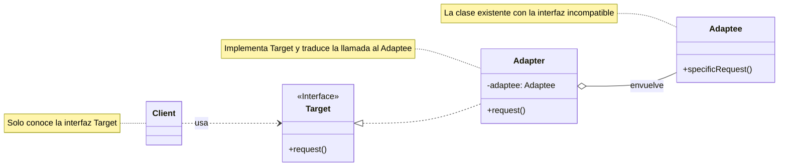

# Teoría
## Definición 

El patrón **Adapter (Adaptador o Envoltorio)** es un patrón de diseño **estructural** que permite que objetos con **interfaces incompatibles** puedan colaborar. Funciona como un traductor o un intermediario: envuelve uno de los objetos para "ocultar" la complejidad de la conversión y presentar una interfaz consistente con la que el resto del sistema ya sabe cómo trabajar.

-----

## Problema

Imagina que tu aplicación procesa pagos y toda tu lógica está construida alrededor de una interfaz estándar `ProcesadorDePago` con un método `realizarPago()`. Ahora, decides integrar un nuevo proveedor de pagos muy popular, "SuperPago", que es excelente pero viene en una librería externa que no puedes modificar.

El problema es que la clase de "SuperPago" no sigue tu estándar; su método se llama `ejecutarCobro()` y recibe los parámetros en un formato diferente.

```java
// Tu sistema usa esta interfaz:
public interface ProcesadorDePago {
    void realizarPago(BigDecimal monto);
}

// La nueva librería tiene esta clase:
public class SuperPago {
    public void ejecutarCobro(String idCliente, double cantidad) {
        // ... lógica del nuevo proveedor
    }
}
```

No puedes simplemente cambiar toda tu aplicación para que use `ejecutarCobro()`, y tampoco puedes modificar la librería de `SuperPago`. Las interfaces son incompatibles.

-----

## Solución

Creas una clase **Adaptador**.

1.  La nueva clase `SuperPagoAdapter` **implementará** tu interfaz estándar `ProcesadorDePago`.
2.  Internamente, el `SuperPagoAdapter` **contendrá una instancia** de la clase `SuperPago` (el objeto que necesita ser adaptado).
3.  Cuando tu sistema llame al método `realizarPago()` en el `SuperPagoAdapter`, el adaptador se encargará de **traducir esa llamada** al formato que `SuperPago` entiende, invocando `ejecutarCobro()` con los datos correctos.

De esta manera, el resto de tu aplicación sigue trabajando con la interfaz `ProcesadorDePago` de siempre, sin siquiera saber que está interactuando con el sistema de "SuperPago" a través de un traductor.

-----

## Estructura (Mermaid UML)

El diagrama muestra cómo el `Adapter` implementa la interfaz `Target` que el `Client` espera, mientras que internamente utiliza el `Adaptee` incompatible.



-----

## Cuándo usar

  * Cuando necesitas usar una clase existente, pero su interfaz no es compatible con el resto de tu código.
  * Cuando quieres reutilizar varias subclases existentes que carecen de una funcionalidad común que no puede ser añadida a su superclase.

## Cuándo no usar

  * Cuando puedes modificar el código fuente de ambos lados para que las interfaces coincidan. El adaptador añade una capa de indirección que puede ser innecesaria si tienes control total.

-----

## Ejemplo en Spring Boot (Java)

```java
// Target (La interfaz que tu sistema usa)
public interface ProcesadorDePago {
    String procesarPago(double monto);
}

// Adaptee (La clase externa con interfaz incompatible)
public class ProveedorExterno {
    public String realizarCargo(String json) {
        // Procesa un cargo en formato JSON
        return "Cargo procesado por ProveedorExterno con JSON: " + json;
    }
}

// Adapter
public class ProveedorExternoAdapter implements ProcesadorDePago {
    private final ProveedorExterno adaptee = new ProveedorExterno();

    @Override
    public String procesarPago(double monto) {
        // Adaptación: convierte el double a un string JSON
        String jsonRequest = String.format("{\"monto\": %.2f}", monto);
        // Delega la llamada al objeto adaptado
        return adaptee.realizarCargo(jsonRequest);
    }
}

// Cliente
@Service
public class ServicioDePagos {
    public void ejecutarPago() {
        // El cliente trabaja con la interfaz Target, sin saber que es un adaptador
        ProcesadorDePago procesador = new ProveedorExternoAdapter();
        System.out.println(procesador.procesarPago(123.45));
    }
}
```

-----

## Ejemplo en Django (Python)

```python
from abc import ABC, abstractmethod
import json

# Target (La interfaz que tu sistema usa)
class ProcesadorDePago(ABC):
    @abstractmethod
    def procesar_pago(self, monto: float) -> str:
        pass

# Adaptee (La clase externa con interfaz incompatible)
class ProveedorExterno:
    def realizar_cargo(self, data: dict) -> str:
        return f"Cargo procesado por ProveedorExterno con datos: {data}"

# Adapter
class ProveedorExternoAdapter(ProcesadorDePago):
    def __init__(self):
        self._adaptee = ProveedorExterno()

    def procesar_pago(self, monto: float) -> str:
        # Adaptación: convierte el float a un diccionario
        data_request = {"monto": monto}
        # Delega la llamada al objeto adaptado
        return self._adaptee.realizar_cargo(data_request)

# Cliente (una vista de Django)
from django.http import JsonResponse

def pagar_view(request):
    monto = 123.45
    # El cliente solo conoce la interfaz ProcesadorDePago
    procesador: ProcesadorDePago = ProveedorExternoAdapter()
    resultado = procesador.procesar_pago(monto)
    return JsonResponse({"resultado": resultado})
```

-----

## Resumen

  * El patrón **Adapter** actúa como un **puente entre dos interfaces incompatibles**.
  * Utiliza un objeto para envolver al objeto "incompatible" (el adaptado).
  * Permite la colaboración entre clases que no podrían interactuar de otra manera, sin necesidad de modificar su código fuente.

-----

# Práctica con Spring Boot

### Paso 1: Creación del Proyecto en IntelliJ IDEA 🚀

1.  Abre IntelliJ IDEA y ve a **File \> New \> Project...**.
2.  Selecciona **Spring Initializr**.
3.  Configura los metadatos:
      * **Name**: `adapter-ejemplo`
      * **Language**: **Java**
      * **Type**: **Gradle - Groovy**
      * **Group**: `com.example.solid`
      * **JDK**: **17** o superior
4.  Haz clic en **Next**.
5.  Añade la dependencia **Spring Web**.
6.  Haz clic en **Create**.

-----

### Paso 2: Estructura de Paquetes 📂

Dentro de `src/main/java/com/example/solid/adapterejemplo`, crea estos paquetes:

  * `target`: Para la interfaz estándar de nuestro sistema.
  * `adaptee`: Para la clase externa que queremos adaptar.
  * `adapter`: Para la clase adaptadora.
  * `controller`: Para el `RestController` que actuará como cliente.

-----

### Paso 3: Codificación del Patrón Adapter 🔌

#### 3.1. Crear la Interfaz `Target`

Dentro del paquete `target`, crea la interfaz que nuestro sistema utiliza.

**`ProcesadorPago.java`**

```java
package com.example.solid.adapterejemplo.target;

public interface ProcesadorPago {
    String procesarPago(double monto);
}
```

#### 3.2. Crear la Clase `Adaptee`

Dentro del paquete `adaptee`, simula la clase externa con una interfaz incompatible.

**`ProveedorPagoXML.java`**

```java
package com.example.solid.adapterejemplo.adaptee;

// Imagina que esta clase viene de una librería externa, por eso no es un @Component.
public class ProveedorPagoXML {
    public String realizarCargo(String xml) {
        System.out.println("Procesando cargo con el siguiente XML: " + xml);
        return "PAGO_EXITOSO_XML";
    }
}
```

#### 3.3. Crear el `Adapter`

Dentro del paquete `adapter`, crea la clase que conecta las dos interfaces.

**`ProveedorPagoXMLAdapter.java`**

```java
package com.example.solid.adapterejemplo.adapter;

import com.example.solid.adapterejemplo.adaptee.ProveedorPagoXML;
import com.example.solid.adapterejemplo.target.ProcesadorPago;
import org.springframework.stereotype.Component;

@Component // Hacemos que el adaptador sea un bean de Spring
public class ProveedorPagoXMLAdapter implements ProcesadorPago {

    private final ProveedorPagoXML adaptee = new ProveedorPagoXML();

    @Override
    public String procesarPago(double monto) {
        // 1. Adaptación de datos: convertimos el double a un formato XML.
        String xmlRequest = String.format("<pago><monto>%.2f</monto></pago>", monto);
        
        // 2. Delegamos la llamada al objeto adaptado.
        return adaptee.realizarCargo(xmlRequest);
    }
}
```

-----

### Paso 4: Crear el Cliente (Controlador REST) 🌐

El controlador solo conocerá la interfaz `ProcesadorPago`. Spring se encargará de inyectar nuestra implementación de adaptador.

**`PagoController.java`**

```java
package com.example.solid.adapterejemplo.controller;

import com.example.solid.adapterejemplo.target.ProcesadorPago;
import org.springframework.beans.factory.annotation.Autowired;
import org.springframework.http.ResponseEntity;
import org.springframework.web.bind.annotation.GetMapping;
import org.springframework.web.bind.annotation.PathVariable;
import org.springframework.web.bind.annotation.RequestMapping;
import org.springframework.web.bind.annotation.RestController;

@RestController
@RequestMapping("/api/pagos")
public class PagoController {

    private final ProcesadorPago procesadorPago;

    // Spring busca un bean que implemente ProcesadorPago y encuentra nuestro Adapter.
    @Autowired
    public PagoController(ProcesadorPago procesadorPago) {
        this.procesadorPago = procesadorPago;
    }

    @GetMapping("/pagar/{monto}")
    public ResponseEntity<String> realizarPago(@PathVariable double monto) {
        // El controlador no sabe que está usando un adaptador, solo usa la interfaz estándar.
        String resultado = procesadorPago.procesarPago(monto);
        return ResponseEntity.ok("Resultado del pago: " + resultado);
    }
}
```

-----

### Paso 5: Probar la Aplicación ✅

1.  Ejecuta la aplicación desde `AdapterEjemploApplication`.

2.  Usa tu navegador o `curl` para probar el endpoint:

    `http://localhost:8080/api/pagos/pagar/499.99`

    **Respuesta esperada en el navegador:**

    ```
    Resultado del pago: PAGO_EXITOSO_XML
    ```

    **Y en la consola de Spring Boot verás el mensaje del `Adaptee`:**

    ```
    Procesando cargo con el siguiente XML: <pago><monto>499.99</monto></pago>
    ```

Esto demuestra que el controlador llamó a la interfaz `ProcesadorPago`, pero el adaptador tradujo la llamada exitosamente para que el `ProveedorPagoXML` la procesara.

-----

# Práctica con Django (Python)

### Paso 1: Creación del Proyecto en PyCharm 🚀

1.  En PyCharm, ve a **File \> New Project...** y selecciona **Django**.
2.  Nombra el proyecto `adapter_django`.
3.  Crea una app inicial llamada `core`.

-----

### Paso 2: Estructura de la App Django 📂

1.  En la terminal de PyCharm, crea una nueva app:
    ```bash
    python manage.py startapp pagos
    ```
2.  Añade `'pagos'` a `INSTALLED_APPS` en `adapter_django/settings.py`.

-----

### Paso 3: Codificación del Patrón Adapter 🔌

Dentro de la app `pagos`, crea los archivos y clases necesarios.

**`pagos/target.py` (La interfaz que tu sistema usa)**

```python
from abc import ABC, abstractmethod

class ProcesadorPago(ABC):
    @abstractmethod
    def procesar_pago(self, monto: float) -> str:
        pass
```

**`pagos/adaptee.py` (La clase externa incompatible)**

```python
class ProveedorPagoJSON:
    def realizar_cargo(self, data: dict) -> dict:
        print(f"Procesando cargo con JSON: {data}")
        return {"status": "SUCCESS", "tx_id": "xyz-123"}
```

**`pagos/adapter.py` (El adaptador)**

```python
from .target import ProcesadorPago
from .adaptee import ProveedorPagoJSON

class ProveedorPagoJSONAdapter(ProcesadorPago):
    def __init__(self):
        self._adaptee = ProveedorPagoJSON()

    def procesar_pago(self, monto: float) -> str:
        # 1. Adaptación de datos: de float a dict
        json_data = {"amount": monto, "currency": "MXN"}
        
        # 2. Delegación de la llamada
        response = self._adaptee.realizar_cargo(json_data)
        
        # 3. Adaptación de la respuesta: de dict a string
        return f"Pago {response['status']} con ID de transacción {response['tx_id']}"
```

-----

### Paso 4: Crear el Cliente (La Vista de Django) 🌐

Modifica `pagos/views.py`.

**`pagos/views.py`**

```python
from django.http import JsonResponse
from .adapter import ProveedorPagoJSONAdapter
from .target import ProcesadorPago

def realizar_pago(request, monto: float):
    # El cliente solo conoce la interfaz ProcesadorPago
    # y recibe una instancia que la cumple (nuestro adaptador).
    procesador: ProcesadorPago = ProveedorPagoJSONAdapter()
    
    resultado = procesador.procesar_pago(monto)
    
    return JsonResponse({"resultado_final": resultado})
```

-----

### Paso 5: Configurar las URLs y Probar ✅

1.  Crea `pagos/urls.py`:

    ```python
    from django.urls import path
    from . import views

    urlpatterns = [
        path('pagar/<float:monto>/', views.realizar_pago),
    ]
    ```

2.  Incluye estas URLs en `adapter_django/urls.py`:

    ```python
    from django.urls import path, include
    urlpatterns = [path('api/pagos/', include('pagos.urls'))]
    ```

3.  Ejecuta `python manage.py runserver` y prueba el endpoint:
    `http://127.0.0.1:8000/api/pagos/pagar/499.99/`

    **Respuesta esperada (JSON):**

    ```json
    {
        "resultado_final": "Pago SUCCESS con ID de transacción xyz-123"
    }
    ```

    Y en la consola de Django verás la salida del `Adaptee`:

    ```
    Procesando cargo con JSON: {'amount': 499.99, 'currency': 'MXN'}
    ```