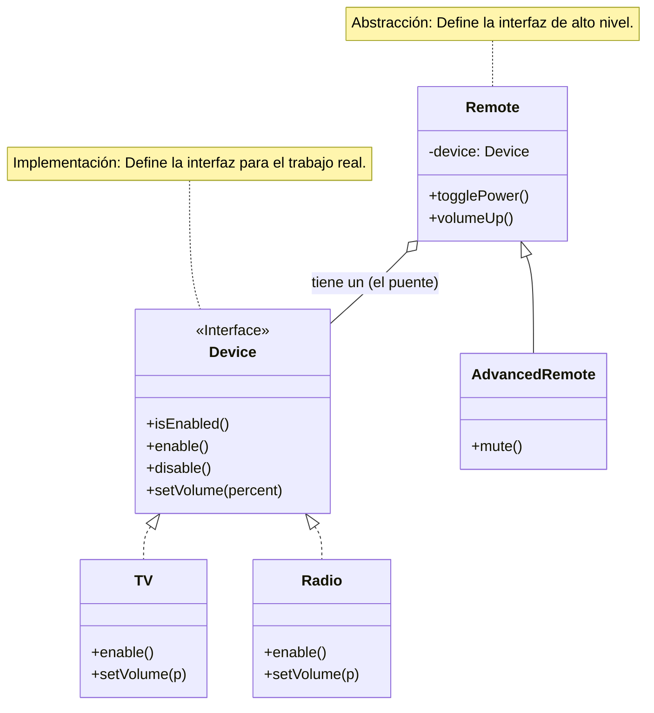

# Teoría

## Definición 

El patrón **Bridge (Puente)** es un patrón de diseño **estructural** que te permite dividir una clase grande o un conjunto de clases estrechamente relacionadas en dos jerarquías separadas —**abstracción** e **implementación**— que pueden desarrollarse independientemente la una de la otra. Su propósito es **desacoplar una abstracción de su implementación**, favoreciendo la **composición sobre la herencia**.

-----

## Problema

Imagina que tienes una clase `Notificacion` con subclases `NotificacionUrgente` y `NotificacionProgramada`. Ahora, quieres enviar estas notificaciones a través de diferentes canales: `Email`, `SMS` y `Push`.

Si usas herencia, te enfrentarás a una "explosión de clases":

  * `NotificacionUrgentePorEmail`, `NotificacionUrgentePorSMS`, `NotificacionUrgentePorPush`
  * `NotificacionProgramadaPorEmail`, `NotificacionProgramadaPorSMS`, `NotificacionProgramadaPorPush`

Añadir un nuevo tipo de notificación (`Informativa`) o un nuevo canal (`Webhook`) obliga a crear múltiples clases nuevas, haciendo el sistema rígido y difícil de mantener.

-----

## Solución

El patrón Bridge extrae una de las dimensiones (el canal de envío) a su propia jerarquía:

1.  **Jerarquía de Abstracción:** Las clases de `Notificacion` (`NotificacionUrgente`, etc.).
2.  **Jerarquía de Implementación:** Una interfaz `CanalDeEnvio` con implementaciones concretas (`CanalEmail`, `CanalSMS`).
3.  La clase base `Notificacion` contiene una referencia (un "puente") a un objeto `CanalDeEnvio`.

Cuando una notificación necesita ser enviada, delega la acción al objeto `CanalDeEnvio` que contiene. Así, puedes crear nuevos tipos de notificación sin tocar los canales, y viceversa.

-----

## Estructura (Mermaid UML)

Este diagrama muestra el ejemplo clásico de `Remote` y `Device`, que ilustra perfectamente la separación de la Abstracción (el control) y la Implementación (el dispositivo).



-----

## Cuándo usar

  * Para dividir clases monolíticas que tienen múltiples variantes de una funcionalidad.
  * Para extender clases en dimensiones independientes (ortogonales).
  * Cuando necesitas poder cambiar la implementación en tiempo de ejecución.

## Cuándo no usar

  * Cuando tienes una sola dimensión que varía. El patrón añade complejidad y no aporta beneficios si no hay dos jerarquías que evolucionen por separado.
  * Si el diseño ya es simple y cohesivo.

-----

## Ejemplo en Spring Boot (Java)

```java
// Implementación (Interfaz)
public interface CanalDeEnvio {
    void enviarMensaje(String asunto, String mensaje);
}

// Implementaciones Concretas
public class CanalEmail implements CanalDeEnvio {
    public void enviarMensaje(String a, String m) { /* Lógica para enviar email */ }
}
public class CanalSMS implements CanalDeEnvio {
    public void enviarMensaje(String a, String m) { /* Lógica para enviar SMS */ }
}

// Abstracción
public abstract class Notificacion {
    protected CanalDeEnvio canal; // El puente

    public Notificacion(CanalDeEnvio canal) {
        this.canal = canal;
    }
    public abstract void notificar();
}

// Abstracción Refinada
public class NotificacionUrgente extends Notificacion {
    public NotificacionUrgente(CanalDeEnvio canal) { super(canal); }

    @Override
    public void notificar() {
        canal.enviarMensaje("¡URGENTE!", "Este es un mensaje crítico.");
    }
}

// Cliente
@Service
public class SistemaDeAlertas {
    public void ejecutar() {
        // El cliente elige qué implementación usar con qué abstracción
        CanalDeEnvio email = new CanalEmail();
        Notificacion notificacionUrgentePorEmail = new NotificacionUrgente(email);
        notificacionUrgentePorEmail.notificar();

        CanalDeEnvio sms = new CanalSMS();
        Notificacion notificacionUrgentePorSMS = new NotificacionUrgente(sms);
        notificacionUrgentePorSMS.notificar();
    }
}
```

-----

## Ejemplo en Django (Python)

```python
from abc import ABC, abstractmethod

# Implementación (Interfaz)
class CanalDeEnvio(ABC):
    @abstractmethod
    def enviar_mensaje(self, asunto: str, mensaje: str) -> str:
        pass

# Implementaciones Concretas
class CanalEmail(CanalDeEnvio):
    def enviar_mensaje(self, asunto, mensaje):
        return f"Email enviado: '{asunto}' - '{mensaje}'"

class CanalSMS(CanalDeEnvio):
    def enviar_mensaje(self, asunto, mensaje):
        return f"SMS enviado: '{mensaje}' (Asunto ignorado)"

# Abstracción
class Notificacion(ABC):
    def __init__(self, canal: CanalDeEnvio):
        self._canal = canal  # El puente

    @abstractmethod
    def notificar(self) -> str:
        pass

# Abstracción Refinada
class NotificacionUrgente(Notificacion):
    def notificar(self) -> str:
        return self._canal.enviar_mensaje("¡URGENTE!", "Este es un mensaje crítico.")

# Cliente (una vista de Django)
from django.http import JsonResponse

def enviar_alerta_view(request, canal_tipo: str):
    if canal_tipo == "email":
        canal = CanalEmail()
    elif canal_tipo == "sms":
        canal = CanalSMS()
    else:
        return JsonResponse({"error": "Canal no válido"}, status=400)

    # El cliente conecta la abstracción con la implementación
    notificacion = NotificacionUrgente(canal)
    resultado = notificacion.notificar()

    return JsonResponse({"resultado": resultado})
```

-----

## Resumen

  * El patrón **Bridge** desacopla la **interfaz de control (Abstracción)** de la **implementación de bajo nivel (Implementación)**.
  * Utiliza la **composición** para evitar la explosión de clases que ocurriría con la herencia.
  * Permite que ambas jerarquías (abstracción e implementación) evolucionen de forma independiente.

-----

# Práctica con Spring Boot

### Paso 1: Creación del Proyecto en IntelliJ IDEA 🚀

1.  Abre IntelliJ IDEA y ve a **File** \> **New** \> **Project...**.
2.  Selecciona **Spring Initializr**.
3.  Configura los metadatos:
      * **Name**: `bridge-ejemplo`
      * **Language**: **Java**
      * **Type**: **Gradle - Groovy**
      * **Group**: `com.example.solid`
      * **JDK**: **17** o superior
4.  Haz clic en **Next**.
5.  Añade la dependencia **Spring Web**.
6.  Haz clic en **Create**.

-----

### Paso 2: Estructura de Paquetes 📂

Dentro de `src/main/java/com/example/solid/bridgeejemplo`, crea estos paquetes:

  * `implementacion`: Contendrá la interfaz del canal de envío y sus implementaciones concretas.
  * `abstraccion`: Contendrá la clase base `Notificacion` y sus subclases refinadas.
  * `controller`: Contendrá el `RestController` que actuará como cliente.

-----

### Paso 3: Codificación del Patrón Bridge 🌉

#### 3.1. Crear la Jerarquía de Implementación

Dentro del paquete `implementacion`, crea la interfaz y las clases concretas.

**`CanalDeEnvio.java` (Interfaz de Implementación)**

```java
package com.example.solid.bridgeejemplo.implementacion;

public interface CanalDeEnvio {
    String enviarMensaje(String asunto, String mensaje);
}
```

**`CanalEmail.java` (Implementación Concreta)**

```java
package com.example.solid.bridgeejemplo.implementacion;

import org.springframework.stereotype.Component;

@Component("email") // Le damos un nombre para inyectarla
public class CanalEmail implements CanalDeEnvio {
    @Override
    public String enviarMensaje(String asunto, String mensaje) {
        return String.format("Email enviado con asunto '%s': '%s'", asunto, mensaje);
    }
}
```

**`CanalSMS.java` (Implementación Concreta)**

```java
package com.example.solid.bridgeejemplo.implementacion;

import org.springframework.stereotype.Component;

@Component("sms")
public class CanalSMS implements CanalDeEnvio {
    @Override
    public String enviarMensaje(String asunto, String mensaje) {
        // Los SMS no suelen tener asunto
        return String.format("SMS enviado: '%s'", mensaje);
    }
}
```

#### 3.2. Crear la Jerarquía de Abstracción

Dentro del paquete `abstraccion`, crea la clase base y las refinadas.

**`Notificacion.java` (Abstracción)**

```java
package com.example.solid.bridgeejemplo.abstraccion;

import com.example.solid.bridgeejemplo.implementacion.CanalDeEnvio;

public abstract class Notificacion {
    protected CanalDeEnvio canalDeEnvio; // El puente

    public Notificacion(CanalDeEnvio canalDeEnvio) {
        this.canalDeEnvio = canalDeEnvio;
    }

    public abstract String notificar(String mensaje);
}
```

**`NotificacionUrgente.java` (Abstracción Refinada)**

```java
package com.example.solid.bridgeejemplo.abstraccion;

import com.example.solid.bridgeejemplo.implementacion.CanalDeEnvio;

public class NotificacionUrgente extends Notificacion {
    public NotificacionUrgente(CanalDeEnvio canalDeEnvio) {
        super(canalDeEnvio);
    }

    @Override
    public String notificar(String mensaje) {
        return canalDeEnvio.enviarMensaje("¡URGENTE!", mensaje);
    }
}
```

**`NotificacionNormal.java` (Abstracción Refinada)**

```java
package com.example.solid.bridgeejemplo.abstraccion;

import com.example.solid.bridgeejemplo.implementacion.CanalDeEnvio;

public class NotificacionNormal extends Notificacion {
    public NotificacionNormal(CanalDeEnvio canalDeEnvio) {
        super(canalDeEnvio);
    }

    @Override
    public String notificar(String mensaje) {
        return canalDeEnvio.enviarMensaje("Informativo", mensaje);
    }
}
```

-----

### Paso 4: Crear el Cliente (Controlador REST) 🌐

Dentro del paquete `controller`, crea el `RestController`.

**`NotificacionController.java`**

```java
package com.example.solid.bridgeejemplo.controller;

import com.example.solid.bridgeejemplo.abstraccion.Notificacion;
import com.example.solid.bridgeejemplo.abstraccion.NotificacionNormal;
import com.example.solid.bridgeejemplo.abstraccion.NotificacionUrgente;
import com.example.solid.bridgeejemplo.implementacion.CanalDeEnvio;
import org.springframework.http.ResponseEntity;
import org.springframework.web.bind.annotation.GetMapping;
import org.springframework.web.bind.annotation.PathVariable;
import org.springframework.web.bind.annotation.RequestMapping;
import org.springframework.web.bind.annotation.RestController;

import java.util.Map;

@RestController
@RequestMapping("/api/notificaciones")
public class NotificacionController {

    private final Map<String, CanalDeEnvio> canales;

    public NotificacionController(Map<String, CanalDeEnvio> canales) {
        this.canales = canales;
    }

    @GetMapping("/enviar/{tipoNotificacion}/{tipoCanal}")
    public ResponseEntity<String> enviarNotificacion(@PathVariable String tipoNotificacion, @PathVariable String tipoCanal) {
        CanalDeEnvio canal = canales.get(tipoCanal);
        if (canal == null) {
            return ResponseEntity.badRequest().body("El canal no es válido.");
        }

        Notificacion notificacion;
        String mensaje = "Revisar el estado del sistema.";

        // El cliente elige qué abstracción usar
        if ("urgente".equalsIgnoreCase(tipoNotificacion)) {
            notificacion = new NotificacionUrgente(canal);
        } else if ("normal".equalsIgnoreCase(tipoNotificacion)) {
            notificacion = new NotificacionNormal(canal);
        } else {
            return ResponseEntity.badRequest().body("El tipo de notificación no es válido.");
        }
        
        // El cliente "conecta" la abstracción con la implementación
        String resultado = notificacion.notificar(mensaje);
        return ResponseEntity.ok(resultado);
    }
}
```

-----

### Paso 5: Probar la Aplicación ✅

1.  Ejecuta la aplicación desde `BridgeEjemploApplication`.
2.  Usa tu navegador o `curl` para probar los endpoints:

<!-- end list -->

  * **Notificación urgente por email:**
    `http://localhost:8080/api/notificaciones/enviar/urgente/email`

    > **Respuesta:** `Email enviado con asunto '¡URGENTE!': 'Revisar el estado del sistema.'`

  * **Notificación urgente por SMS:**
    `http://localhost:8080/api/notificaciones/enviar/urgente/sms`

    > **Respuesta:** `SMS enviado: 'Revisar el estado del sistema.'`

  * **Notificación normal por email:**
    `http://localhost:8080/api/notificaciones/enviar/normal/email`

    > **Respuesta:** `Email enviado con asunto 'Informativo': 'Revisar el estado del sistema.'`

-----

# Práctica con Django (Python)

### Paso 1: Creación del Proyecto en PyCharm 🚀

1.  En PyCharm, ve a **File** \> **New Project...** y selecciona **Django**.
2.  Nombra el proyecto `bridge_django`.
3.  Crea una app inicial llamada `core`.
4.  Haz clic en **Create**.

-----

### Paso 2: Estructura de la App Django 📂

1.  En la terminal de PyCharm, crea una nueva app:
    ```bash
    python manage.py startapp notificaciones
    ```
2.  Añade `'notificaciones'` a `INSTALLED_APPS` en `bridge_django/settings.py`.
3.  Dentro de `notificaciones`, crea los archivos `implementacion.py` y `abstraccion.py`.

-----

### Paso 3: Codificación del Patrón Bridge 🌉

#### 3.1. Crear la Jerarquía de Implementación

**`notificaciones/implementacion.py`**

```python
from abc import ABC, abstractmethod

class CanalDeEnvio(ABC):
    @abstractmethod
    def enviar_mensaje(self, asunto: str, mensaje: str) -> str:
        pass

class CanalEmail(CanalDeEnvio):
    def enviar_mensaje(self, asunto, mensaje):
        return f"Email enviado con asunto '{asunto}': '{mensaje}'"

class CanalSMS(CanalDeEnvio):
    def enviar_mensaje(self, asunto, mensaje):
        return f"SMS enviado: '{mensaje}'"
```

#### 3.2. Crear la Jerarquía de Abstracción

**`notificaciones/abstraccion.py`**

```python
from abc import ABC, abstractmethod
from .implementacion import CanalDeEnvio

class Notificacion(ABC):
    def __init__(self, canal: CanalDeEnvio):
        self._canal = canal  # El puente

    @abstractmethod
    def notificar(self, mensaje: str) -> str:
        pass

class NotificacionUrgente(Notificacion):
    def notificar(self, mensaje: str) -> str:
        return self._canal.enviar_mensaje("¡URGENTE!", mensaje)

class NotificacionNormal(Notificacion):
    def notificar(self, mensaje: str) -> str:
        return self._canal.enviar_mensaje("Informativo", mensaje)
```

-----

### Paso 4: Crear el Cliente (La Vista de Django) 🌐

Modifica `notificaciones/views.py`.

**`notificaciones/views.py`**

```python
from django.http import JsonResponse
from .implementacion import CanalEmail, CanalSMS
from .abstraccion import NotificacionNormal, NotificacionUrgente

CANALES = {"email": CanalEmail, "sms": CanalSMS}
NOTIFICACIONES = {"normal": NotificacionNormal, "urgente": NotificacionUrgente}

def enviar_notificacion(request, tipo_notificacion: str, tipo_canal: str):
    canal_class = CANALES.get(tipo_canal)
    notificacion_class = NOTIFICACIONES.get(tipo_notificacion)

    if not canal_class or not notificacion_class:
        return JsonResponse({"error": "Tipo de canal o notificación no válido"}, status=400)
    
    # El cliente conecta la implementación con la abstracción
    canal = canal_class()
    notificacion = notificacion_class(canal)
    
    mensaje = "Revisar el estado del sistema."
    resultado = notificacion.notificar(mensaje)

    return JsonResponse({"resultado": resultado})
```

-----

### Paso 5: Configurar las URLs y Probar ✅

1.  Crea `notificaciones/urls.py`:
    ```python
    from django.urls import path
    from . import views

    urlpatterns = [
        path('enviar/<str:tipo_notificacion>/<str:tipo_canal>/', views.enviar_notificacion),
    ]
    ```
2.  Incluye estas URLs en `bridge_django/urls.py`:
    ```python
    from django.urls import path, include
    urlpatterns = [path('api/notificaciones/', include('notificaciones.urls'))]
    ```
3.  Ejecuta `python manage.py runserver` y prueba los endpoints:
      * `http://127.0.0.1:8000/api/notificaciones/enviar/urgente/email/`
        > **Respuesta:** `{"resultado": "Email enviado con asunto '¡URGENTE!': 'Revisar el estado del sistema.'"}`
      * `http://127.0.0.1:8000/api/notificaciones/enviar/normal/sms/`
        > **Respuesta:** `{"resultado": "SMS enviado: 'Revisar el estado del sistema.'"}`