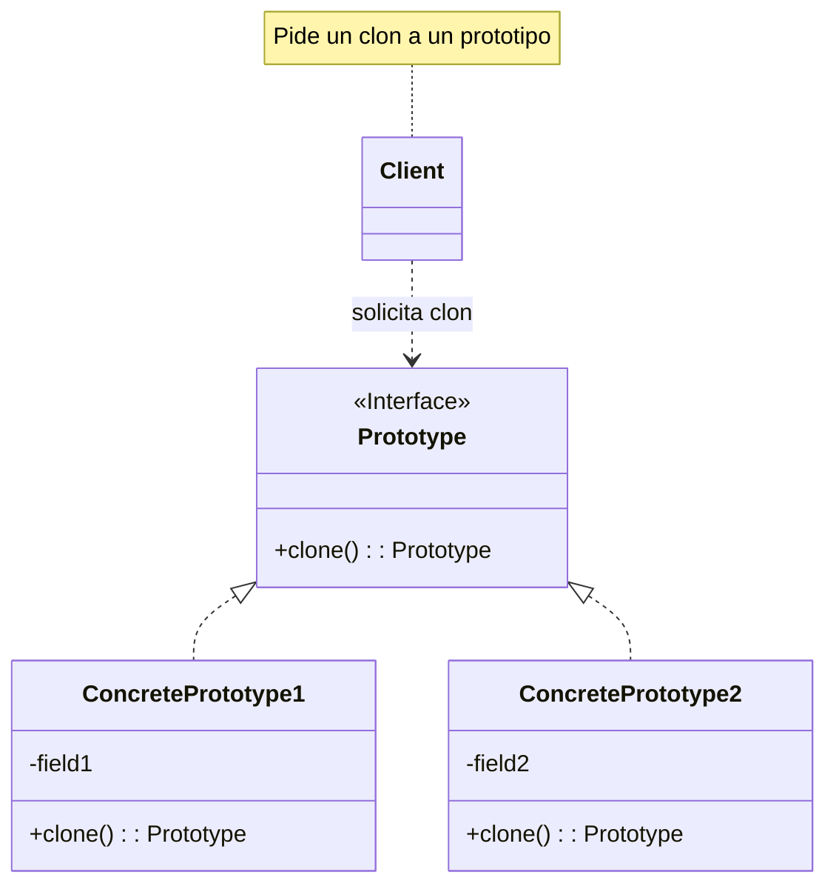

# Teoría

## Definición 🧬

El patrón **Prototype (Prototipo)** es un patrón de diseño **creacional** que te permite crear nuevos objetos **copiando una instancia existente**, en lugar de crear el objeto desde cero. A esta instancia que se copia se le llama "prototipo".

Funciona declarando un método de clonación en una interfaz común. Todas las clases que soportan la clonación pueden ser copiadas para crear nuevos objetos con el mismo estado inicial, que luego pueden ser modificados.

-----

## Problema

Imagina que tienes un objeto que es muy **costoso de crear**. Su instanciación podría requerir consultas a la base de datos, llamadas a servicios de red, cálculos complejos o la lectura de archivos de configuración pesados.

Si necesitas crear muchas instancias de este objeto, o instancias que son muy similares entre sí, repetir este costoso proceso de creación una y otra vez es muy ineficiente. Por ejemplo, cargar la configuración de un objeto `Reporte` con su logo, pie de página y estilos corporativos cada vez que se genera un nuevo reporte.

-----

## Solución

En lugar de construir el objeto desde cero, el patrón Prototype propone una solución más directa:

1.  **Crear un objeto prototipo:** Se crea una instancia inicial del objeto con la configuración base (por ejemplo, el `Reporte` corporativo).
2.  **Clonar el prototipo:** Cuando se necesita un nuevo objeto, en lugar de usar el operador `new` y reconfigurar todo, se le pide al prototipo que se clone a sí mismo.
3.  **Modificar el clon:** El nuevo objeto es una copia exacta del prototipo, pero es una instancia completamente independiente. Ahora puedes modificar los detalles específicos (como el título o el contenido) del clon sin afectar al prototipo original.

Esto es especialmente útil cuando la mayoría de los objetos que necesitas son variaciones de un mismo "molde".

-----

## Estructura (Mermaid UML)

El diagrama es simple: un cliente pide a un prototipo que se clone, y recibe un nuevo objeto del mismo tipo.



A menudo, se utiliza un **Registro de Prototipos (Prototype Registry)**, que es una clase que gestiona un conjunto de prototipos listos para ser clonados bajo demanda.

-----

## Cuándo usar

  * Cuando la creación de un objeto es costosa y es más eficiente copiar uno existente.
  * Cuando tu código no debe depender de las clases concretas de los objetos que necesitas copiar.
  * Cuando quieres ofrecer un conjunto de "objetos predefinidos" que los clientes puedan configurar.

## Cuándo no usar

  * Cuando los objetos son simples, no tienen un estado complicado y su creación no consume muchos recursos.
  * Si tu objeto tiene muchas referencias circulares o una lógica de clonación muy compleja que podría generar errores.

-----

## Ejemplo en Spring Boot (Java)

```java
// Interfaz Prototype
public interface DocumentoPrototype extends Cloneable {
    DocumentoPrototype clonar();
    void setContenido(String contenido);
}

// Prototipo Concreto
public class Contrato implements DocumentoPrototype {
    private String tipo;
    private String contenidoBase; // Contenido costoso de cargar

    public Contrato() { 
        this.tipo = "Contrato de Confidencialidad";
        // Imagina que esto se carga de un archivo o DB
        this.contenidoBase = "Este es el texto legal base..."; 
    }
    
    @Override
    public DocumentoPrototype clonar() {
        return new Contrato(); // Clonación simple en este caso
    }
    
    @Override
    public void setContenido(String contenido) { this.contenidoBase = contenido; }
}

// Cliente
@Service
public class GestorDocumentos {
    public void generarDocumentos() {
        Contrato prototipoContrato = new Contrato();
        
        // Creamos un nuevo contrato clonando el prototipo
        Contrato nuevoContrato = (Contrato) prototipoContrato.clonar();
        nuevoContrato.setContenido("...añadiendo cláusulas específicas para el empleado X.");

        // El prototipo original no ha cambiado
    }
}
```

-----

## Ejemplo en Django (Python)

```python
import copy

# Prototipo (puede ser una clase base o no)
class Documento:
    def __init__(self, titulo, contenido_base):
        self.titulo = titulo
        self.contenido = contenido_base
        # Imagina que contenido_base es costoso de generar

    def clonar(self):
        # deepcopy crea una copia completamente independiente
        return copy.deepcopy(self)

# Cliente (una vista de Django)
from django.http import JsonResponse

# Registro de Prototipos
PROTOTIPOS = {
    "contrato": Documento("Contrato de Empleado", "Texto legal base..."),
    "informe": Documento("Informe Mensual", "Estructura base del informe...")
}

def crear_documento_view(request, tipo: str):
    prototipo = PROTOTIPOS.get(tipo)
    if not prototipo:
        return JsonResponse({"error": "Tipo de documento no válido"}, status=400)

    # Clonamos el prototipo
    nuevo_documento = prototipo.clonar()
    
    # Modificamos el clon
    nuevo_documento.contenido += "\nSección añadida para el departamento de ventas."
    
    return JsonResponse(nuevo_documento.__dict__)
```

-----

## Resumen

  * El patrón **Prototype** se basa en **clonar objetos** existentes para crear otros nuevos.
  * Es una alternativa a la creación de objetos mediante `new` cuando esta es computacionalmente costosa.
  * Permite crear objetos sin acoplar el código cliente a sus clases concretas, ya que el cliente solo necesita saber cómo clonar.

-----

# Práctica con Spring Boot

### Paso 1: Creación del Proyecto en IntelliJ IDEA 🚀

1.  Abre IntelliJ IDEA y ve a **File \> New \> Project...**.
2.  Selecciona **Spring Initializr**.
3.  Configura los metadatos:
      * **Name**: `prototype-ejemplo`
      * **Language**: **Java**
      * **Type**: **Gradle - Groovy**
      * **Group**: `com.example.solid`
      * **JDK**: **17** o superior
4.  Haz clic en **Next**.
5.  Añade la dependencia **Spring Web**.
6.  Haz clic en **Create**.

-----

### Paso 2: Estructura de Paquetes 📂

Dentro de `src/main/java/com/example/solid/prototypeejemplo`, crea estos paquetes:

  * `model`: Contendrá nuestras clases de documentos que actuarán como prototipos.
  * `registry`: Contendrá una clase para gestionar y servir los prototipos.
  * `controller`: Contendrá nuestro `RestController` que actuará como cliente.

-----

### Paso 3: Codificación del Patrón Prototype 🧬

#### 3.1. Crear los Prototipos

Dentro del paquete `model`, crea la clase base y las implementaciones concretas.

**`Documento.java` (Prototipo Abstracto)**

```java
package com.example.solid.prototypeejemplo.model;

import lombok.Data;

@Data // De Lombok para getters/setters
public abstract class Documento implements Cloneable {
    private String titulo;
    private String contenido;
    private String firma;

    @Override
    public Documento clone() {
        try {
            return (Documento) super.clone();
        } catch (CloneNotSupportedException e) {
            // Esto no debería pasar, ya que implementamos Cloneable
            return null;
        }
    }
}
```

**`Contrato.java` (Prototipo Concreto)**

```java
package com.example.solid.prototypeejemplo.model;

public class Contrato extends Documento {
    // Puedes añadir campos específicos del contrato si quieres
}
```

**`Informe.java` (Prototipo Concreto)**

```java
package com.example.solid.prototypeejemplo.model;

public class Informe extends Documento {
    // Puedes añadir campos específicos del informe si quieres
}
```

#### 3.2. Crear el Registro de Prototipos

Dentro del paquete `registry`, crea una clase que cargue y gestione los prototipos.

**`DocumentoRegistry.java`**

```java
package com.example.solid.prototypeejemplo.registry;

import com.example.solid.prototypeejemplo.model.Contrato;
import com.example.solid.prototypeejemplo.model.Documento;
import com.example.solid.prototypeejemplo.model.Informe;
import jakarta.annotation.PostConstruct;
import org.springframework.stereotype.Component;

import java.util.HashMap;
import java.util.Map;

@Component
public class DocumentoRegistry {

    private final Map<String, Documento> prototipos = new HashMap<>();

    @PostConstruct // Este método se ejecuta cuando Spring crea el bean
    public void cargarPrototipos() {
        // Creamos y configuramos nuestros prototipos base una sola vez
        Contrato contratoBase = new Contrato();
        contratoBase.setTitulo("Contrato de Confidencialidad Estándar");
        contratoBase.setContenido("Texto legal base que es costoso de cargar...");
        contratoBase.setFirma("Firma Digital de la Empresa");

        Informe informeBase = new Informe();
        informeBase.setTitulo("Plantilla de Informe Mensual");
        informeBase.setContenido("Estructura base del informe...");
        informeBase.setFirma("Firma del Departamento de BI");

        prototipos.put("contrato", contratoBase);
        prototipos.put("informe", informeBase);
    }

    public Documento crearDocumento(String tipo) {
        Documento prototipo = prototipos.get(tipo);
        if (prototipo != null) {
            return prototipo.clone(); // ¡Devolvemos un clon, no el original!
        }
        return null;
    }
}
```

-----

### Paso 4: Crear el Cliente (Controlador REST) 🌐

Dentro del paquete `controller`, crea el `RestController`.

**`DocumentoController.java`**

```java
package com.example.solid.prototypeejemplo.controller;

import com.example.solid.prototypeejemplo.model.Documento;
import com.example.solid.prototypeejemplo.registry.DocumentoRegistry;
import org.springframework.http.ResponseEntity;
import org.springframework.web.bind.annotation.GetMapping;
import org.springframework.web.bind.annotation.PathVariable;
import org.springframework.web.bind.annotation.RequestMapping;
import org.springframework.web.bind.annotation.RequestParam;
import org.springframework.web.bind.annotation.RestController;

@RestController
@RequestMapping("/api/documentos")
public class DocumentoController {

    private final DocumentoRegistry registry;

    public DocumentoController(DocumentoRegistry registry) {
        this.registry = registry;
    }

    @GetMapping("/crear/{tipo}")
    public ResponseEntity<Documento> crearDocumento(@PathVariable String tipo, @RequestParam String autor) {
        Documento nuevoDocumento = registry.crearDocumento(tipo);

        if (nuevoDocumento == null) {
            return ResponseEntity.badRequest().build();
        }

        // Modificamos el clon con datos específicos de la petición
        nuevoDocumento.setTitulo(nuevoDocumento.getTitulo() + " para " + autor);
        nuevoDocumento.setFirma(autor);

        return ResponseEntity.ok(nuevoDocumento);
    }
}
```

-----

### Paso 5: Probar la Aplicación ✅

1.  Ejecuta la aplicación desde `PrototypeEjemploApplication`.
2.  Usa tu navegador o `curl` para probar los endpoints:

<!-- end list -->

  * **Crear un contrato para "Ángel":**
    `http://localhost:8080/api/documentos/crear/contrato?autor=Angel`

    **Respuesta esperada (JSON):**

    ```json
    {
        "titulo": "Contrato de Confidencialidad Estándar para Angel",
        "contenido": "Texto legal base que es costoso de cargar...",
        "firma": "Angel"
    }
    ```

  * **Crear un informe para "Jesús":**
    `http://localhost:8080/api/documentos/crear/informe?autor=Jesus`

    **Respuesta esperada (JSON):**

    ```json
    {
        "titulo": "Plantilla de Informe Mensual para Jesus",
        "contenido": "Estructura base del informe...",
        "firma": "Jesus"
    }
    ```

Como puedes ver, cada petición genera un nuevo objeto basado en el prototipo, pero con sus propias modificaciones.

-----

# Práctica con Django (Python)

### Paso 1: Creación del Proyecto en PyCharm 🚀

1.  En PyCharm, ve a **File \> New Project...** y selecciona **Django**.
2.  Nombra el proyecto `prototype_django` y crea una app inicial `core`.

-----

### Paso 2: Estructura de la App Django 📂

1.  En la terminal, crea una nueva app:
    ```bash
    python manage.py startapp documentos
    ```
2.  Añade `'documentos'` a `INSTALLED_APPS` en `prototype_django/settings.py`.

-----

### Paso 3: Codificación del Patrón Prototype 🧬

#### 3.1. Crear los Prototipos

En Python, la clonación es más sencilla con el módulo `copy`.

**`documentos/models.py`** (Usaremos este archivo aunque no sean modelos de DB)

```python
import copy
from dataclasses import dataclass, field

@dataclass
class Documento:
    titulo: str = ""
    contenido: str = ""
    firma: str = ""

    def clonar(self):
        # deepcopy crea una copia recursiva y completamente independiente
        return copy.deepcopy(self)

@dataclass
class Contrato(Documento):
    pass

@dataclass
class Informe(Documento):
    pass
```

#### 3.2. Crear el Registro de Prototipos

**`documentos/registry.py`**

```python
from .models import Contrato, Informe, Documento

class DocumentoRegistry:
    def __init__(self):
        self._prototipos = {}
        self._cargar_prototipos()

    def _cargar_prototipos(self):
        self._prototipos["contrato"] = Contrato(
            titulo="Contrato de Confidencialidad Estándar",
            contenido="Texto legal base que es costoso de cargar...",
            firma="Firma Digital de la Empresa"
        )
        self._prototipos["informe"] = Informe(
            titulo="Plantilla de Informe Mensual",
            contenido="Estructura base del informe...",
            firma="Firma del Departamento de BI"
        )
        
    def crear_documento(self, tipo: str) -> Documento | None:
        prototipo = self._prototipos.get(tipo)
        return prototipo.clonar() if prototipo else None

# Instanciamos el registro para que sea un Singleton de facto
registry_instance = DocumentoRegistry()
```

-----

### Paso 4: Crear el Cliente (La Vista de Django) 🌐

**`documentos/views.py`**

```python
from django.http import JsonResponse
from .registry import registry_instance
import dataclasses

def crear_documento(request, tipo: str):
    autor = request.GET.get("autor", "Desconocido")
    
    # Usamos el registro para obtener un clon
    nuevo_documento = registry_instance.crear_documento(tipo)
    
    if not nuevo_documento:
        return JsonResponse({"error": "Tipo de documento no válido"}, status=400)
        
    # Modificamos el clon
    nuevo_documento.titulo += f" para {autor}"
    nuevo_documento.firma = autor
    
    # Convertimos el dataclass a dict para la respuesta JSON
    return JsonResponse(dataclasses.asdict(nuevo_documento))
```

-----

### Paso 5: Configurar las URLs y Probar ✅

1.  Crea `documentos/urls.py`:
    ```python
    from django.urls import path
    from . import views

    urlpatterns = [
        path('crear/<str:tipo>/', views.crear_documento),
    ]
    ```
2.  Incluye estas URLs en `prototype_django/urls.py`:
    ```python
    from django.urls import path, include
    urlpatterns = [path('api/documentos/', include('documentos.urls'))]
    ```
3.  Ejecuta `python manage.py runserver` y prueba los endpoints:
      * `http://127.0.0.1:8000/api/documentos/crear/contrato/?autor=Angel`
        > **Respuesta:** `{"titulo": "Contrato de Confidencialencialidad Estándar para Angel", "contenido": "Texto legal base...", "firma": "Angel"}`
      * `http://127.0.0.1:8000/api/documentos/crear/informe/?autor=Jesus`
        > **Respuesta:** `{"titulo": "Plantilla de Informe Mensual para Jesus", "contenido": "Estructura base del informe...", "firma": "Jesus"}`