# Teoría

## Definición ☝️

El patrón **Singleton** es un patrón de diseño **creacional** que garantiza que una clase tenga **una sola instancia** en toda la aplicación y proporciona un **punto de acceso global** a ella.

Es como tener una única llave maestra 🔑 para un recurso específico: no importa quién la pida, siempre recibirá la misma llave.

-----

## Problema

Hay situaciones en las que necesitas asegurarte de que solo exista un objeto de un tipo particular. Algunos ejemplos comunes son:

  * **Gestión de Configuración:** Cargar la configuración de la aplicación una sola vez y que todos los componentes accedan a la misma versión.
  * **Conexiones a Recursos:** Administrar un *pool* de conexiones a una base de datos o un gestor de logging centralizado.
  * **Servicios del Sistema Operativo:** Interactuar con un gestor de ventanas o un sistema de archivos, donde solo debe haber una instancia controladora.

Si permitieras crear múltiples instancias de estas clases, podrías causar inconsistencias, consumir recursos innecesariamente o tener comportamientos inesperados (imagina dos objetos intentando escribir en el mismo archivo de log de forma descoordinada). Además, necesitarías una forma fácil para que cualquier parte del código acceda a esa única instancia.

-----

## Solución

El patrón Singleton resuelve esto implementando tres elementos clave dentro de la propia clase:

1.  **Constructor Privado:** Se impide que otras clases creen instancias directamente usando el operador `new` (o su equivalente).
2.  **Instancia Estática Privada:** La clase guarda su única instancia en un campo estático y privado.
3.  **Método Estático Público (`getInstance`)**: La clase proporciona un método estático público que devuelve la instancia única. La primera vez que se llama, crea la instancia; las siguientes veces, simplemente devuelve la instancia ya existente.

-----

## Estructura (Mermaid UML)

El diagrama es muy simple: la clase `Singleton` se referencia a sí misma para guardar su única instancia y ofrece un método estático para obtenerla.

```mermaid
classDiagram
    direction TB

    class Singleton {
        -Singleton instance
        -Singleton()
        +getInstance(): Singleton
        +someBusinessLogic()
    }
    note for Singleton "Guarda su propia instancia única\ny proporciona un método para acceder a ella."

    Singleton -- Singleton : instance
```



-----

## Cuándo usar

  * Cuando necesitas **exactamente una instancia** de una clase, y esta debe ser accesible desde un punto bien conocido.
  * Cuando el objeto único debe ser extensible mediante subclases, y los clientes deben poder usar una instancia extendida sin cambiar su código (aunque esto es menos común y más complejo).

## Cuándo no usar

  * **Viola el Principio de Responsabilidad Única:** La clase se encarga tanto de su lógica de negocio como de gestionar su propia instanciación única.
  * **Introduce Acoplamiento Global:** Hace que el código cliente dependa de una clase concreta global, dificultando las pruebas unitarias (no puedes reemplazar fácilmente el Singleton con un mock).
  * **Problemas en Multihilo:** La implementación simple (`lazy initialization`) puede fallar si varios hilos intentan crear la instancia al mismo tiempo. Requiere sincronización cuidadosa.
  * **Frameworks Modernos:** Frameworks como Spring ya gestionan el ciclo de vida de los objetos y proporcionan Singletons por defecto (beans con scope singleton), haciendo la implementación manual a menudo innecesaria.

-----

## Ejemplo en Java (Implementación Clásica)

```java
public class ConfiguracionGlobal {
    // 2. Instancia estática privada (inicialización temprana - thread-safe)
    private static final ConfiguracionGlobal instancia = new ConfiguracionGlobal();
    
    private String urlBaseDatos;

    // 1. Constructor privado
    private ConfiguracionGlobal() {
        // Simula la carga costosa de configuración
        System.out.println("Cargando configuración...");
        this.urlBaseDatos = "jdbc:mysql://localhost/produccion"; 
    }

    // 3. Método estático público para obtener la instancia
    public static ConfiguracionGlobal getInstance() {
        return instancia;
    }

    // Métodos de negocio
    public String getUrlBaseDatos() {
        return urlBaseDatos;
    }
}

// Cliente
public class Main {
    public static void main(String[] args) {
        ConfiguracionGlobal config1 = ConfiguracionGlobal.getInstance();
        ConfiguracionGlobal config2 = ConfiguracionGlobal.getInstance();

        System.out.println("URL: " + config1.getUrlBaseDatos());
        
        if (config1 == config2) {
            System.out.println("config1 y config2 son la misma instancia.");
        }
    }
}
```

-----

## Ejemplo en Python (Usando Módulos - Idiomático)

En Python, la forma más sencilla y común de tener un Singleton es **usar un módulo**. Los módulos en Python se importan una sola vez por sesión, por lo que su estado es compartido globalmente.

```python
# config.py (Este módulo actúa como Singleton)
print("Cargando configuración...")
url_base_datos = "jdbc:mysql://localhost/produccion"

def get_url():
    return url_base_datos

# main.py (Cliente 1)
import config

print(f"Main 1 - URL: {config.get_url()}")

# otro_modulo.py (Cliente 2)
import config

print(f"Otro Módulo - URL: {config.get_url()}")

# Ejecución (simulada):
# Cargando configuración...  <-- Solo se imprime una vez
# Main 1 - URL: jdbc:mysql://localhost/produccion
# Otro Módulo - URL: jdbc:mysql://localhost/produccion 
```

-----

## Resumen

  * El patrón **Singleton** asegura **una única instancia** de una clase.
  * Proporciona un **punto de acceso global** a esa instancia.
  * Se implementa con un constructor privado y un método estático `getInstance`.
  * Debe usarse con precaución debido a sus posibles desventajas (acoplamiento global, dificultad para pruebas).
  * En frameworks modernos como Spring, la gestión de Singletons suele estar integrada.

-----

# Práctica con Spring Boot

En Spring Boot, **los beans son Singletons por defecto**. No necesitas implementar el patrón manualmente. Spring se encarga de crear una única instancia de tus componentes (`@Component`, `@Service`, `@Repository`, `@Controller`, `@Configuration`) y de inyectar esa misma instancia donde sea requerida.

### Paso 1: Creación del Proyecto en IntelliJ IDEA 🚀

1.  Abre IntelliJ IDEA y ve a **File \> New \> Project...**.
2.  Selecciona **Spring Initializr**.
3.  Configura los metadatos:
      * **Name**: `singleton-spring-ejemplo`
      * **Language**: **Java**
      * **Type**: **Gradle - Groovy**
      * **Group**: `com.example.solid`
      * **JDK**: **17** o superior
4.  Haz clic en **Next**.
5.  Añade la dependencia **Spring Web**.
6.  Haz clic en **Create**.

-----

### Paso 2: Estructura de Paquetes 📂

Dentro de `src/main/java/com/example/solid/singletonspringejemplo`, crea estos paquetes:

  * `config`: Para nuestra clase de configuración Singleton.
  * `service`: Para un servicio que usará la configuración.
  * `controller`: Para un controlador que también usará la configuración.

-----

### Paso 3: Codificación del "Singleton" Gestionado por Spring ⚙️

#### 3.1. Crear la Clase Singleton

Dentro del paquete `config`, crea la clase. Spring la convertirá en Singleton.

**`AppConfig.java`**

```java
package com.example.solid.singletonspringejemplo.config;

import org.springframework.stereotype.Component;
import jakarta.annotation.PostConstruct;

@Component // ¡Esta anotación le dice a Spring que gestione esta clase como un bean Singleton!
public class AppConfig {

    private String databaseUrl;
    private int maxConnections;

    public AppConfig() {
        System.out.println("****** AppConfig CONSTRUCTOR LLAMADO ******");
        // Simula la carga de configuración
        this.databaseUrl = "jdbc:h2:mem:testdb";
        this.maxConnections = 10;
    }

    @PostConstruct // Se ejecuta después de que el constructor termina
    public void init() {
        System.out.println("****** AppConfig INICIALIZADO (@PostConstruct) ******");
        System.out.println("Configuración cargada: DB URL=" + databaseUrl + ", Max Conexiones=" + maxConnections);
    }

    // Getters
    public String getDatabaseUrl() { return databaseUrl; }
    public int getMaxConnections() { return maxConnections; }
}
```

  * **`@Component`**: Es la clave. Le indica a Spring: "Crea una única instancia de esta clase y guárdala".

-----

### Paso 4: Crear Clientes que Usen el Singleton

#### 4.1. Crear un Servicio

Dentro del paquete `service`, crea una clase que pida la configuración.

**`UserService.java`**

```java
package com.example.solid.singletonspringejemplo.service;

import com.example.solid.singletonspringejemplo.config.AppConfig;
import org.springframework.stereotype.Service;

@Service
public class UserService {

    private final AppConfig appConfig;

    // Spring inyecta la ÚNICA instancia de AppConfig aquí
    public UserService(AppConfig appConfig) {
        System.out.println("****** UserService CONSTRUCTOR - Recibiendo AppConfig: " + appConfig.hashCode() + " ******");
        this.appConfig = appConfig;
    }

    public String getUserConfigInfo() {
        return "UserService usando DB URL: " + appConfig.getDatabaseUrl();
    }
}
```

#### 4.2. Crear un Controlador

Dentro del paquete `controller`, crea otra clase que también pida la configuración.

**`ConfigController.java`**

```java
package com.example.solid.singletonspringejemplo.controller;

import com.example.solid.singletonspringejemplo.config.AppConfig;
import com.example.solid.singletonspringejemplo.service.UserService;
import org.springframework.web.bind.annotation.GetMapping;
import org.springframework.web.bind.annotation.RequestMapping;
import org.springframework.web.bind.annotation.RestController;

@RestController
@RequestMapping("/api/config")
public class ConfigController {

    private final AppConfig appConfig;
    private final UserService userService;

    // Spring inyecta la MISMA instancia de AppConfig aquí
    public ConfigController(AppConfig appConfig, UserService userService) {
        System.out.println("****** ConfigController CONSTRUCTOR - Recibiendo AppConfig: " + appConfig.hashCode() + " ******");
        this.appConfig = appConfig;
        this.userService = userService;
    }

    @GetMapping("/info")
    public String getConfigInfo() {
        String controllerInfo = "ConfigController usando Max Conexiones: " + appConfig.getMaxConnections();
        String serviceInfo = userService.getUserConfigInfo();
        
        // Comprobaremos si ambas clases recibieron la misma instancia
        return controllerInfo + " | " + serviceInfo + 
               " | HashCode de AppConfig en Controller: " + appConfig.hashCode();
    }
}
```

  * **`hashCode()`**: Usamos `hashCode()` para obtener un identificador único del objeto en memoria. Si los hash codes son iguales, significa que es la misma instancia.

-----

### Paso 5: Probar la Aplicación ✅

1.  Ejecuta la aplicación desde `SingletonSpringEjemploApplication`.

2.  **Observa la Consola:** Verás los mensajes `****** ... ******`. Notarás que el constructor de `AppConfig` y su método `init` se llaman **solo una vez** al inicio. Luego, verás que tanto `UserService` como `ConfigController` reciben un `AppConfig` con el **mismo hash code**.

3.  Usa tu navegador o `curl` para probar el endpoint:
    `http://localhost:8080/api/config/info`

    **Respuesta esperada (el hash code puede variar):**

    ```
    ConfigController usando Max Conexiones: 10 | UserService usando DB URL: jdbc:h2:mem:testdb | HashCode de AppConfig en Controller: 123456789 
    ```

    El hash code mostrado será el mismo que viste en la consola, confirmando que ambos componentes usan la **única instancia** de `AppConfig` creada por Spring.

-----

# Práctica con Django (Python)

Como mencionamos en la teoría, en Python la forma más idiomática de lograr un Singleton es usando **módulos**. Cuando importas un módulo, Python lo carga en memoria una sola vez y reutiliza esa misma instancia cada vez que se importa de nuevo.

### Paso 1: Creación del Proyecto en PyCharm 🚀

1.  En PyCharm, ve a **File \> New Project...** y selecciona **Django**.
2.  Nombra el proyecto `singleton_django` y crea una app inicial `core`.

-----

### Paso 2: Estructura de la App Django 📂

1.  En la terminal, crea una nueva app:
```bash
python manage.py startapp config_app
```
1.  Añade `'config_app'` a `INSTALLED_APPS` en `singleton_django/settings.py`.

-----

### Paso 3: Codificación del "Singleton" como Módulo ⚙️

Dentro de la app `config_app`, crea un archivo para nuestra configuración.

**`config_app/app_config.py`**

```python
# Este módulo completo actúa como un Singleton.
# El código aquí solo se ejecuta UNA VEZ cuando se importa por primera vez.

print("****** Cargando app_config.py (¡Debería pasar solo una vez!) ******")

# Estado global compartido
_database_url = "jdbc:h2:mem:testdb_django"
_max_connections = 5
_carga_inicial_completa = False

def inicializar_configuracion():
    global _carga_inicial_completa
    if not _carga_inicial_completa:
        print("****** Realizando inicialización costosa... ******")
        # Simula una carga pesada
        import time
        time.sleep(1) # Espera 1 segundo
        _carga_inicial_completa = True
        print("****** Inicialización completada ******")

def get_database_url():
    inicializar_configuracion() # Asegura que la inicialización ocurra antes de usar
    return _database_url

def get_max_connections():
    inicializar_configuracion()
    return _max_connections

# Llama a la inicialización al cargar el módulo si es necesario
# inicializar_configuracion() # Opcional: podrías llamarla aquí directamente
```

  * Todo lo que está definido en este archivo (`_database_url`, `get_database_url`, etc.) existirá en una **única instancia** en memoria una vez que el módulo sea importado.

-----

### Paso 4: Crear Clientes que Usen el Módulo Singleton

Crearemos dos vistas diferentes que importen y usen `app_config`.

**`config_app/views.py`**

```python
from django.http import JsonResponse
# Importamos nuestro módulo Singleton
from . import app_config 
import random 

def vista_uno(request):
    print(f"****** Vista Uno - Usando app_config ID: {id(app_config)} ******")
    
    # Accede a la configuración
    db_url = app_config.get_database_url()
    
    # Simulamos un cambio (aunque no es buena práctica modificar config global así)
    # Solo para demostrar que es el mismo objeto
    if random.random() < 0.5: 
         app_config._database_url = "jdbc:h2:mem:testdb_django_MODIFICADO"
         print("****** Vista Uno - URL MODIFICADA ******")
         
    return JsonResponse({
        "vista": "uno",
        "db_url": db_url,
        "max_conn": app_config.get_max_connections(),
        "config_id": id(app_config) # ID del objeto módulo en memoria
    })

def vista_dos(request):
    print(f"****** Vista Dos - Usando app_config ID: {id(app_config)} ******")
    
    # Accede a la configuración (la misma instancia que vista_uno)
    db_url = app_config.get_database_url() 
    
    return JsonResponse({
        "vista": "dos",
        "db_url": db_url, 
        "max_conn": app_config.get_max_connections(),
        "config_id": id(app_config) # Debería ser el mismo ID que en vista_uno
    })
```

  * **`id(app_config)`**: Devuelve el identificador único del objeto `app_config` en memoria. Si es el mismo en ambas vistas, confirma que es la misma instancia.

-----

### Paso 5: Configurar las URLs y Probar ✅

1.  Crea `config_app/urls.py`:

    ```python
    from django.urls import path
    from . import views

    urlpatterns = [
        path('vista1/', views.vista_uno),
        path('vista2/', views.vista_dos),
    ]
    ```

2.  Incluye estas URLs en `singleton_django/urls.py`:

    ```python
    from django.urls import path, include
    urlpatterns = [path('api/config/', include('config_app.urls'))]
    ```

3.  Ejecuta `python manage.py runserver`.

4.  **Observa la Consola del Servidor:** Al iniciar, deberías ver el mensaje `"****** Cargando app_config.py ... ******"` **una sola vez**. También verás el mensaje de inicialización costosa la primera vez que una vista lo llame.

5.  Prueba los endpoints en tu navegador varias veces y en diferente orden:

      * `http://127.0.0.1:8000/api/config/vista1/`
      * `http://127.0.0.1:8000/api/config/vista2/`

    **Respuestas esperadas (JSON, los IDs serán iguales):**

    ```json
    // Para vista1
    {
        "vista": "uno",
        "db_url": "jdbc:h2:mem:testdb_django", // O la versión modificada
        "max_conn": 5,
        "config_id": 1401234567890 
    }
    ```

    ```json
    // Para vista2
    {
        "vista": "dos",
        "db_url": "jdbc:h2:mem:testdb_django", // Verás la versión modificada si vista1 la cambió
        "max_conn": 5,
        "config_id": 1401234567890 // MISMO ID que en vista1
    }
    ```

    El hecho de que el `config_id` sea el mismo y que los cambios hechos en `vista_uno` (la modificación de la URL) se reflejen en `vista_dos` demuestra que ambas están interactuando con la **única instancia** del módulo `app_config`.