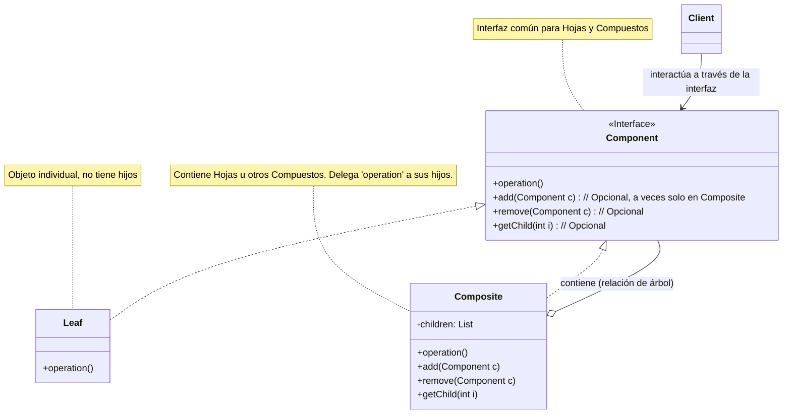

## Definición

El patrón **Composite (Compuesto)** es un patrón de diseño **estructural** que te permite componer objetos en **estructuras de árbol** para representar jerarquías de parte-todo. Lo fundamental es que permite a los clientes tratar **objetos individuales (hojas)** y **composiciones de objetos (compuestos)** de manera **uniforme**.

Es como pensar en un sistema de archivos: puedes realizar la misma operación (ej. `calcularTamaño`) tanto en un archivo individual como en una carpeta completa (que contiene otros archivos y carpetas).

-----

## Problema

Imagina que estás construyendo un editor gráfico. Tienes objetos simples como `Punto`, `Linea`, `Circulo`. También necesitas poder agrupar estos objetos para formar figuras más complejas (un `GrupoGrafico`).

Si tratas los objetos simples y los grupos de forma diferente, tu código cliente se llenará de condicionales `if-else` para saber si está trabajando con un objeto simple o un grupo:

```java
void dibujarFigura(Object figura) {
    if (figura instanceof Circulo) {
        ((Circulo) figura).dibujarCirculo();
    } else if (figura instanceof GrupoGrafico) {
        // Necesitas iterar sobre los hijos del grupo
        for (Object hijo : ((GrupoGrafico) figura).getHijos()) {
            dibujarFigura(hijo); // Llamada recursiva
        }
    } // ... y así para cada tipo de figura
}
```

Este código es difícil de mantener. Cada vez que añades una nueva forma o tipo de grupo, tienes que modificar esta lógica.

-----

## Solución

El patrón Composite resuelve esto creando una **interfaz común (Componente)** para todos los objetos de la jerarquía, tanto los simples como los compuestos.

1.  **Componente:** Define una interfaz común para todos los objetos (simples y compuestos), declarando las operaciones que se pueden realizar (ej. `dibujar()`, `mover()`).
2.  **Hoja (Leaf):** Representa los objetos individuales (primitivos) de la composición. Implementa la interfaz `Componente` pero no tiene hijos. (Ej. `Punto`, `Circulo`).
3.  **Compuesto (Composite):** Representa los objetos que pueden contener otros componentes (hojas u otros compuestos). Implementa la interfaz `Componente` y además tiene métodos para gestionar sus hijos (ej. `agregar()`, `eliminar()`). Cuando se le pide realizar una operación (como `dibujar()`), típicamente **delega la operación a sus hijos**. (Ej. `GrupoGrafico`).

El cliente interactúa con todos los objetos a través de la interfaz `Componente`, sin necesidad de saber si es una hoja o un compuesto.

-----

## Estructura (Mermaid UML)

El diagrama muestra la interfaz `Component`, las clases `Leaf` que la implementan, y la clase `Composite` que también la implementa y además contiene una lista de `Component`.



-----

## Cuándo usar

  * Cuando necesitas representar jerarquías de objetos parte-todo (como árboles).
  * Cuando quieres que los clientes puedan tratar objetos individuales y composiciones de objetos de manera uniforme.

## Cuándo no usar

  * Si la jerarquía es simple o fija y no necesitas tratar los objetos y sus composiciones de la misma forma.
  * A veces, la interfaz `Componente` puede volverse "pesada" si intentas incluir todas las operaciones posibles tanto para hojas como para compuestos (especialmente los métodos de gestión de hijos como `add`/`remove`, que no tienen sentido para las hojas).

-----

## Ejemplo en Java (Sin Frameworks)

```java
import java.util.ArrayList;
import java.util.List;

// 1. Componente
interface ComponenteGrafico {
    void dibujar();
}

// 2. Hoja (Leaf)
class Punto implements ComponenteGrafico {
    private int x, y;
    public Punto(int x, int y) { this.x = x; this.y = y; }
    @Override public void dibujar() { System.out.println("Dibujando Punto en (" + x + "," + y + ")"); }
}

// 2. Hoja (Leaf)
class Circulo implements ComponenteGrafico {
    private int x, y, radio;
    public Circulo(int x, int y, int radio) { /*...*/ this.radio = radio; }
    @Override public void dibujar() { System.out.println("Dibujando Círculo con radio " + radio); }
}

// 3. Compuesto (Composite)
class GrupoGrafico implements ComponenteGrafico {
    private List<ComponenteGrafico> hijos = new ArrayList<>();
    
    public void agregar(ComponenteGrafico hijo) { hijos.add(hijo); }
    
    @Override 
    public void dibujar() {
        System.out.println("Dibujando Grupo:");
        // Delega la operación a los hijos
        for (ComponenteGrafico hijo : hijos) {
            hijo.dibujar();
        }
    }
}

// Cliente
public class Main {
    public static void main(String[] args) {
        Punto p1 = new Punto(10, 10);
        Circulo c1 = new Circulo(20, 20, 5);
        
        GrupoGrafico grupo = new GrupoGrafico();
        grupo.agregar(p1);
        grupo.agregar(c1);
        
        // El cliente trata al grupo como un componente más
        grupo.dibujar(); 
    }
}
```

-----

## Ejemplo en Python (Sin Frameworks)

```python
from abc import ABC, abstractmethod
from typing import List

# 1. Componente
class ComponenteGrafico(ABC):
    @abstractmethod
    def dibujar(self) -> str:
        pass

# 2. Hoja (Leaf)
class Punto(ComponenteGrafico):
    def __init__(self, x, y): self.x, self.y = x, y
    def dibujar(self) -> str: return f"Punto en ({self.x},{self.y})"

# 2. Hoja (Leaf)
class Circulo(ComponenteGrafico):
    def __init__(self, x, y, radio): self.radio = radio # ...
    def dibujar(self) -> str: return f"Círculo con radio {self.radio}"

# 3. Compuesto (Composite)
class GrupoGrafico(ComponenteGrafico):
    def __init__(self):
        self._hijos: List[ComponenteGrafico] = []
        
    def agregar(self, hijo: ComponenteGrafico): self._hijos.append(hijo)
    
    def dibujar(self) -> str:
        resultados = ["Grupo:"]
        # Delega a los hijos
        for hijo in self._hijos:
            resultados.append(hijo.dibujar())
        return "\n  ".join(resultados)

# Cliente
p1 = Punto(10, 10)
c1 = Circulo(20, 20, 5)
grupo = GrupoGrafico()
grupo.agregar(p1)
grupo.agregar(c1)

print(grupo.dibujar()) 
# Salida:
# Grupo:
#   Punto en (10,10)
#   Círculo con radio 5
```

-----

## Resumen

  * El patrón **Composite** te permite construir **estructuras de árbol** donde los nodos individuales (hojas) y los nodos contenedores (compuestos) implementan la **misma interfaz**.
  * El cliente puede **tratar a todos los elementos de manera uniforme**, simplificando el código que recorre o manipula la jerarquía.
  * Es fundamental para representar jerarquías parte-todo.

-----

# Práctica con Spring Booti

### Paso 1: Creación del Proyecto en IntelliJ IDEA 🚀

1.  Abre IntelliJ IDEA y ve a **File \> New \> Project...**.
2.  Selecciona **Spring Initializr**.
3.  Configura los metadatos:
      * **Name**: `composite-spring-ejemplo`
      * **Language**: **Java**
      * **Type**: **Gradle - Groovy**
      * **Group**: `com.example.solid`
      * **JDK**: **17** o superior
4.  Haz clic en **Next**.
5.  Añade la dependencia **Spring Web**.
6.  Haz clic en **Create**.

-----

### Paso 2: Estructura de Paquetes 📂

Dentro de `src/main/java/com/example/solid/compositespringejemplo`, crea estos paquetes:

  * `component`: Para la interfaz/clase base Componente y las clases Hoja y Compuesto.
  * `controller`: Para el `RestController` que actuará como cliente.

-----

### Paso 3: Codificación del Patrón Composite 🖼️

#### 3.1. Crear la Jerarquía del Componente Gráfico

Dentro del paquete `component`, crea las siguientes clases.

**`ComponenteGrafico.java` (Interfaz Componente)**

```java
package com.example.solid.compositespringejemplo.component;

import java.util.List;

// Usaremos una interfaz que devuelve una representación en String
public interface ComponenteGrafico {
    String dibujar();
}
```

**`Punto.java` (Clase Hoja)**

```java
package com.example.solid.compositespringejemplo.component;

// No necesita ser @Component de Spring, ya que se crearán dinámicamente
public class Punto implements ComponenteGrafico {
    private int x, y;

    public Punto(int x, int y) {
        this.x = x;
        this.y = y;
    }

    @Override
    public String dibujar() {
        return String.format("Punto(%d, %d)", x, y);
    }
}
```

**`Circulo.java` (Clase Hoja)**

```java
package com.example.solid.compositespringejemplo.component;

public class Circulo implements ComponenteGrafico {
    private int x, y, radio;

    public Circulo(int x, int y, int radio) {
        this.x = x;
        this.y = y;
        this.radio = radio;
    }

    @Override
    public String dibujar() {
        return String.format("Circulo(centro=(%d, %d), radio=%d)", x, y, radio);
    }
}
```

**`GrupoGrafico.java` (Clase Compuesto)**

```java
package com.example.solid.compositespringejemplo.component;

import java.util.ArrayList;
import java.util.List;
import java.util.stream.Collectors;

public class GrupoGrafico implements ComponenteGrafico {
    private List<ComponenteGrafico> hijos = new ArrayList<>();
    private String nombre;

    public GrupoGrafico(String nombre) {
        this.nombre = nombre;
    }

    public void agregar(ComponenteGrafico componente) {
        hijos.add(componente);
    }

    public void eliminar(ComponenteGrafico componente) {
        hijos.remove(componente);
    }

    @Override
    public String dibujar() {
        // Delega a los hijos y formatea la salida
        String hijosDibujados = hijos.stream()
                                     .map(ComponenteGrafico::dibujar)
                                     .collect(Collectors.joining("\n  "));
        return String.format("Grupo '%s':\n  %s", nombre, hijosDibujados);
    }
}
```

-----

### Paso 4: Crear el Cliente (Controlador REST) 🌐

Dentro del paquete `controller`, crea el `RestController`. Este construirá una estructura de ejemplo y la devolverá.

**`GraficoController.java`**

```java
package com.example.solid.compositespringejemplo.controller;

import com.example.solid.compositespringejemplo.component.Circulo;
import com.example.solid.compositespringejemplo.component.ComponenteGrafico;
import com.example.solid.compositespringejemplo.component.GrupoGrafico;
import com.example.solid.compositespringejemplo.component.Punto;
import org.springframework.http.ResponseEntity;
import org.springframework.web.bind.annotation.GetMapping;
import org.springframework.web.bind.annotation.RequestMapping;
import org.springframework.web.bind.annotation.RestController;

@RestController
@RequestMapping("/api/graficos")
public class GraficoController {

    @GetMapping("/demo")
    public ResponseEntity<String> obtenerGraficoDemo() {
        // El cliente construye la estructura de árbol
        GrupoGrafico dibujoCompleto = new GrupoGrafico("Dibujo Principal");
        
        Punto punto1 = new Punto(10, 10);
        Circulo circulo1 = new Circulo(20, 30, 15);
        
        GrupoGrafico subGrupo = new GrupoGrafico("Carita Feliz");
        Circulo cara = new Circulo(100, 100, 50);
        Punto ojoIzq = new Punto(85, 85);
        Punto ojoDer = new Punto(115, 85);
        
        subGrupo.agregar(cara);
        subGrupo.agregar(ojoIzq);
        subGrupo.agregar(ojoDer);
        
        dibujoCompleto.agregar(punto1);
        dibujoCompleto.agregar(circulo1);
        dibujoCompleto.agregar(subGrupo); // Agregamos un grupo dentro de otro
        
        // El cliente llama a la operación sobre la raíz del árbol
        String resultado = dibujoCompleto.dibujar();
        
        // Devolvemos el resultado como texto plano para verlo fácilmente
        return ResponseEntity.ok(resultado);
    }
}
```

-----

### Paso 5: Probar la Aplicación ✅

1.  Ejecuta la aplicación desde `CompositeSpringEjemploApplication`.

2.  Usa tu navegador o `curl` para probar el endpoint:
    `http://localhost:8080/api/graficos/demo`

    **Respuesta esperada (texto plano):**

```
Grupo 'Dibujo Principal':
  Punto(10, 10)
  Circulo(centro=(20, 30), radio=15)
  Grupo 'Carita Feliz':
	Circulo(centro=(100, 100), radio=50)
	Punto(85, 85)
	Punto(115, 85)
```

Esto demuestra cómo el cliente pudo construir una jerarquía compleja y luego llamar a `dibujar()` en la raíz, tratando toda la estructura de manera uniforme gracias al patrón Composite.

-----

# Práctica con Django (Python)

### Paso 1: Creación del Proyecto en PyCharm 🚀

1.  En PyCharm, ve a **File \> New Project...** y selecciona **Django**.
2.  Nombra el proyecto `composite_django` y crea una app inicial `core`.

-----

### Paso 2: Estructura de la App Django 📂

1.  En la terminal, crea una nueva app:
```bash
python manage.py startapp graficos
```
1.  Añade `'graficos'` a `INSTALLED_APPS` en `composite_django/settings.py`.

-----

### Paso 3: Codificación del Patrón Composite 🖼️

Dentro de la app `graficos`, crea un archivo `components.py`.

**`graficos/components.py`**

```python
from abc import ABC, abstractmethod
from typing import List

# 1. Componente
class ComponenteGrafico(ABC):
    @abstractmethod
    def dibujar(self) -> str:
        pass

# 2. Hojas (Leaf)
class Punto(ComponenteGrafico):
    def __init__(self, x: int, y: int):
        self.x, self.y = x, y
    def dibujar(self) -> str:
        return f"Punto({self.x}, {self.y})"

class Circulo(ComponenteGrafico):
    def __init__(self, x: int, y: int, radio: int):
        self.x, self.y, self.radio = x, y, radio
    def dibujar(self) -> str:
        return f"Circulo(centro=({self.x}, {self.y}), radio={self.radio})"

# 3. Compuesto (Composite)
class GrupoGrafico(ComponenteGrafico):
    def __init__(self, nombre: str):
        self.nombre = nombre
        self._hijos: List[ComponenteGrafico] = []

    def agregar(self, componente: ComponenteGrafico):
        self._hijos.append(componente)

    def eliminar(self, componente: ComponenteGrafico):
        self._hijos.remove(componente)

    def dibujar(self) -> str:
        # Delega a los hijos y formatea
        hijos_dibujados = "\n  ".join(hijo.dibujar() for hijo in self._hijos)
        return f"Grupo '{self.nombre}':\n  {hijos_dibujados}"

```

-----

### Paso 4: Crear el Cliente (La Vista de Django) 🌐

Modifica `graficos/views.py`.

**`graficos/views.py`**

```python
from django.http import HttpResponse # Usaremos texto plano para la respuesta
from .components import Punto, Circulo, GrupoGrafico

def demo_grafico(request):
    # El cliente construye la estructura de árbol
    dibujo_completo = GrupoGrafico("Dibujo Principal")
    
    punto1 = Punto(10, 10)
    circulo1 = Circulo(20, 30, 15)
    
    sub_grupo = GrupoGrafico("Carita Feliz")
    cara = Circulo(100, 100, 50)
    ojo_izq = Punto(85, 85)
    ojo_der = Punto(115, 85)
    
    sub_grupo.agregar(cara)
    sub_grupo.agregar(ojo_izq)
    sub_grupo.agregar(ojo_der)
    
    dibujo_completo.agregar(punto1)
    dibujo_completo.agregar(circulo1)
    dibujo_completo.agregar(sub_grupo)
    
    # El cliente llama a la operación sobre la raíz
    resultado = dibujo_completo.dibujar()
    
    # Devuelve el resultado como texto plano
    return HttpResponse(resultado, content_type="text/plain")
```

-----

### Paso 5: Configurar las URLs y Probar ✅

1.  Crea `graficos/urls.py`:

    ```python
    from django.urls import path
    from . import views

    urlpatterns = [
        path('demo/', views.demo_grafico),
    ]
    ```

2.  Incluye estas URLs en `composite_django/urls.py`:

    ```python
    from django.urls import path, include
    urlpatterns = [path('api/graficos/', include('graficos.urls'))]
    ```

3.  Ejecuta `python manage.py runserver` y prueba el endpoint:
    `http://127.0.0.1:8000/api/graficos/demo/`

    **Respuesta esperada (texto plano en el navegador):**

```
Grupo 'Dibujo Principal':
  Punto(10, 10)
  Circulo(centro=(20, 30), radio=15)
  Grupo 'Carita Feliz':
	Circulo(centro=(100, 100), radio=50)
	Punto(85, 85)
	Punto(115, 85)
```