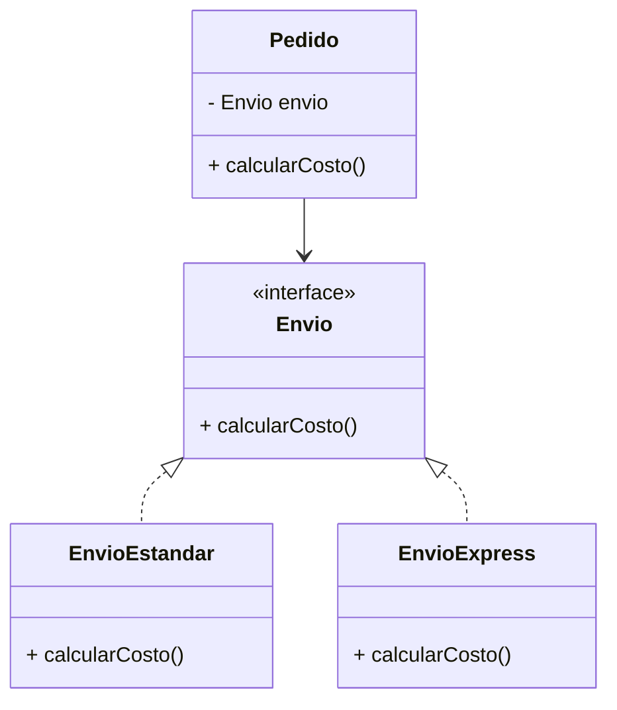

# O: Principio de Abierto/Cerrado (Open/Closed Principle)

## Definición

El **Principio de Abierto/Cerrado (OCP)** establece que:
**“Las clases deben estar abiertas a la extensión pero cerradas a la modificación”.**

Esto significa que:

* Una clase puede ser **extendida** para añadir nuevas funcionalidades.
* Pero su **código existente no debe modificarse** al hacerlo.

---

## Motivación

* Evita romper el código probado cuando se añaden nuevas funciones.
* Favorece la extensibilidad mediante **herencia** o **interfaces**.
* Se aplica frecuentemente con patrones como **Strategy** o **Factory**.

---

## Ejemplo conceptual

Clase `Pedido` que calcula costos de envío:

* **Antes (violando OCP):** cada nuevo método de envío requiere modificar la clase `Pedido`.
* **Después (aplicando OCP):** se extrae la lógica de envío en una interfaz común `Envio`, y se crean clases concretas (`EnvioExpress`, `EnvioEstandar`, etc.).

---

## Diagrama (Mermaid)



---

## Ejemplo en Spring Boot (Java, IntelliJ IDEA)

### Antes (violando OCP)

```java
public class Pedido {
    public double calcularEnvio(String tipo) {
        if ("ESTANDAR".equals(tipo)) {
            return 50.0;
        } else if ("EXPRESS".equals(tipo)) {
            return 100.0;
        }
        return 0.0;
    }
}
```

Problema: cada vez que agregamos un nuevo método de envío, hay que modificar `Pedido`.

### Después (aplicando OCP con Strategy)

```java
public interface Envio {
    double calcularCosto();
}

public class EnvioEstandar implements Envio {
    public double calcularCosto() {
        return 50.0;
    }
}

public class EnvioExpress implements Envio {
    public double calcularCosto() {
        return 100.0;
    }
}

public class Pedido {
    private final Envio envio;

    public Pedido(Envio envio) {
        this.envio = envio;
    }

    public double calcularEnvio() {
        return envio.calcularCosto();
    }
}
```

Ahora, agregar un nuevo tipo de envío significa **crear una nueva clase**, sin tocar `Pedido`.

---

## Ejemplo en Django (Python, PyCharm)

### Antes (violando OCP)

```python
class Pedido:
    def calcular_envio(self, tipo):
        if tipo == "ESTANDAR":
            return 50.0
        elif tipo == "EXPRESS":
            return 100.0
        return 0.0
```

Cada nuevo tipo de envío requiere **modificar `Pedido`**.

### Después (aplicando OCP con Strategy)

```python
from abc import ABC, abstractmethod

class Envio(ABC):
    @abstractmethod
    def calcular_costo(self):
        pass

class EnvioEstandar(Envio):
    def calcular_costo(self):
        return 50.0

class EnvioExpress(Envio):
    def calcular_costo(self):
        return 100.0

class Pedido:
    def __init__(self, envio: Envio):
        self.envio = envio

    def calcular_envio(self):
        return self.envio.calcular_costo()
```

Ahora basta con **crear una nueva clase de envío** (`EnvioMaritimo`, `EnvioInternacional`, etc.) sin tocar `Pedido`.

---

## Conclusión

El **Principio de Abierto/Cerrado (OCP)** permite:

* **Extender funcionalidades** sin modificar código probado.
* Reducir riesgos de errores en el sistema.
* Diseñar software más **flexible y mantenible**.
