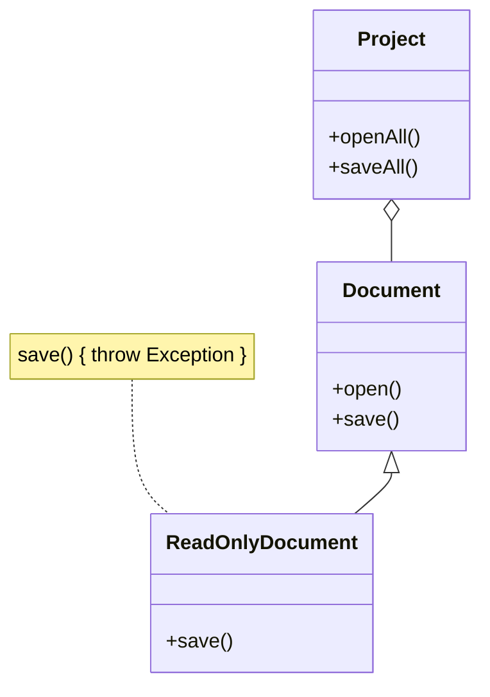
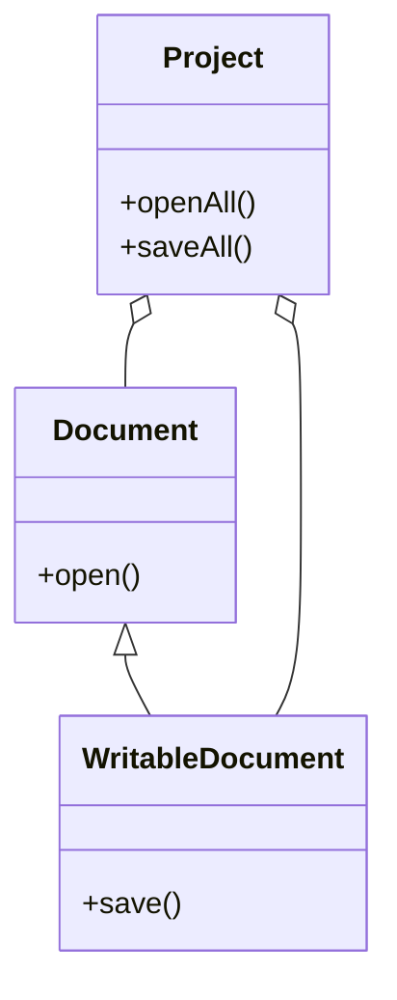

# L: Principio de Sustitución de Liskov (LSP)

## Definición

El **Principio de Sustitución de Liskov (LSP)** dice que:
**“Las subclases deben poder sustituir a sus superclases sin alterar el correcto funcionamiento del programa”.**

Esto implica que:

* Una subclase debe **respetar el contrato** de la superclase.
* No debe **restringir** más de lo que ya hacía la clase padre.
* No debe **romper la compatibilidad** del código cliente.

---

## Problema típico

* Si una subclase cambia el comportamiento esperado de la clase padre, el código cliente falla.
* Ejemplo: un `Documento` con método `guardar()`. Una subclase `DocumentoSoloLectura` lanza una excepción en `guardar()`. Esto rompe el principio, ya que **no puede sustituir** a `Documento` en el cliente.

---

## Solución

* Rediseñar la jerarquía:

  * `DocumentoSoloLectura` se convierte en la clase base.
  * `DocumentoEscritura` extiende de esta y agrega la operación de `guardar()`.

---

## Diagramas

### Antes (violando LSP)



### Después (aplicando LSP)



---

## Ejemplo en Spring Boot (Java, IntelliJ IDEA)

### Antes (violando LSP)

```java
public class Document {
    public void open() {
        System.out.println("Opening document...");
    }

    public void save() {
        System.out.println("Saving document...");
    }
}

public class ReadOnlyDocument extends Document {
    @Override
    public void save() {
        throw new UnsupportedOperationException("No se puede guardar un documento de solo lectura.");
    }
}
```

El código cliente falla si recibe un `ReadOnlyDocument` cuando espera un `Document`.

### Después (aplicando LSP)

```java
public class Document {
    public void open() {
        System.out.println("Opening document...");
    }
}

public class WritableDocument extends Document {
    public void save() {
        System.out.println("Saving document...");
    }
}
```

Ahora, `WritableDocument` **extiende** el comportamiento de `Document` sin romperlo.

---

## Ejemplo en Django (Python, PyCharm)

### Antes (violando LSP)

```python
class Document:
    def open(self):
        print("Opening document...")

    def save(self):
        print("Saving document...")

class ReadOnlyDocument(Document):
    def save(self):
        raise Exception("No se puede guardar un documento de solo lectura.")
```

Si el cliente usa `ReadOnlyDocument` en lugar de `Document`, el programa se rompe.

### Después (aplicando LSP)

```python
class Document:
    def open(self):
        print("Opening document...")

class WritableDocument(Document):
    def save(self):
        print("Saving document...")
```

De esta forma, el cliente puede usar `Document` o `WritableDocument` sin errores.

---

## Conclusión

El **Principio de Sustitución de Liskov (LSP)** garantiza:

* Jerarquías de clases coherentes.
* Compatibilidad entre superclases y subclases.
* Mayor robustez y mantenibilidad del código.
