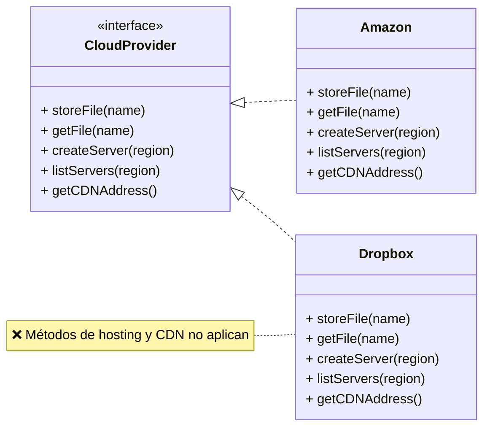
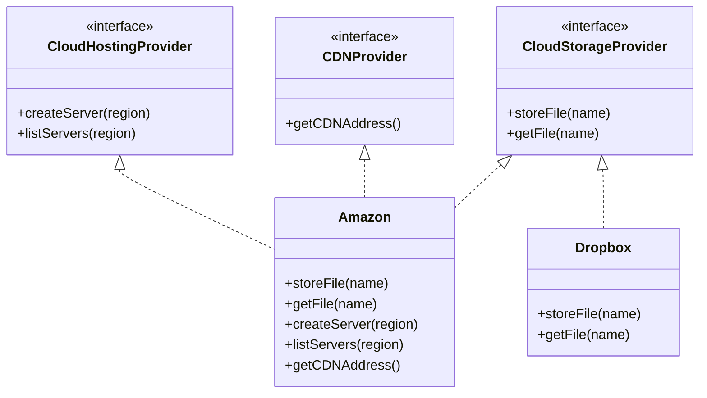

# I: Principio de Segregación de Interfaces (ISP)

## Definición

El **Interface Segregation Principle (ISP)** establece que:
**“Los clientes no deben estar obligados a depender de métodos que no utilizan.”**

## Idea clave

* Las interfaces deben ser **específicas y pequeñas**.
* Una interfaz “gorda” con muchos métodos obliga a que las clases implementen cosas que **no necesitan**.
* Mejor dividir interfaces en **partes más refinadas** y que las clases implementen solo lo que realmente usan.

---

## Ejemplo general (Cloud Providers)

### Antes (violando ISP)

Una única interfaz muy amplia:



### Después (aplicando ISP)

Interfaces divididas en partes más pequeñas:



---

## Ejemplo en Spring Boot (Java)

### Antes (violando ISP)

```java
public interface CloudProvider {
    void storeFile(String name);
    String getFile(String name);
    void createServer(String region);
    void listServers(String region);
    String getCDNAddress();
}

public class Dropbox implements CloudProvider {
    @Override
    public void storeFile(String name) { ... }
    @Override
    public String getFile(String name) { ... }

    // Métodos que no aplican
    @Override
    public void createServer(String region) {
        throw new UnsupportedOperationException("No soportado.");
    }
    @Override
    public void listServers(String region) {
        throw new UnsupportedOperationException("No soportado.");
    }
    @Override
    public String getCDNAddress() {
        throw new UnsupportedOperationException("No soportado.");
    }
}
```

### Después (aplicando ISP)

```java
public interface CloudStorageProvider {
    void storeFile(String name);
    String getFile(String name);
}

public interface CloudHostingProvider {
    void createServer(String region);
    void listServers(String region);
}

public interface CDNProvider {
    String getCDNAddress();
}

public class Dropbox implements CloudStorageProvider {
    @Override
    public void storeFile(String name) { ... }
    @Override
    public String getFile(String name) { ... }
}
```

---

## Ejemplo en Django (Python)

### Antes (violando ISP)

```python
class CloudProvider:
    def store_file(self, name): pass
    def get_file(self, name): pass
    def create_server(self, region): pass
    def list_servers(self, region): pass
    def get_cdn_address(self): pass

class Dropbox(CloudProvider):
    def store_file(self, name): ...
    def get_file(self, name): ...
    # Métodos que no aplican
    def create_server(self, region): raise NotImplementedError
    def list_servers(self, region): raise NotImplementedError
    def get_cdn_address(self): raise NotImplementedError
```

### Después (aplicando ISP)

```python
class CloudStorageProvider:
    def store_file(self, name): pass
    def get_file(self, name): pass

class CloudHostingProvider:
    def create_server(self, region): pass
    def list_servers(self, region): pass

class CDNProvider:
    def get_cdn_address(self): pass

class Dropbox(CloudStorageProvider):
    def store_file(self, name): ...
    def get_file(self, name): ...
```

---

## Conclusión

El **ISP** evita interfaces infladas y asegura que:

* Los clientes solo implementan lo que realmente necesitan.
* El código es más **modular, flexible y limpio**.

