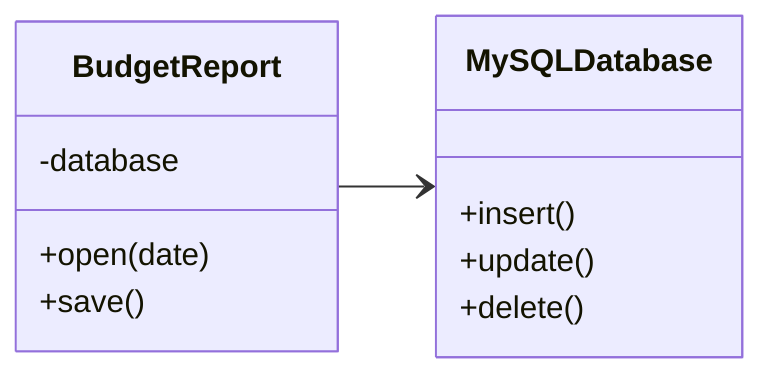
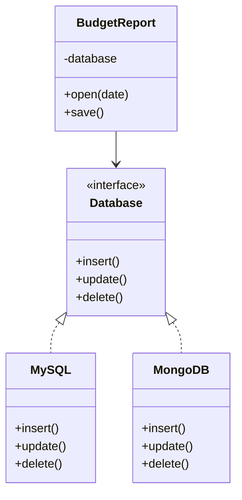

# D: Principio de Inversión de Dependencias (DIP)

## Definición

El **Dependency Inversion Principle (DIP)** establece:
**“Las clases de alto nivel no deben depender de clases de bajo nivel. Ambas deben depender de abstracciones.”**

## Idea clave

* **Alto nivel**: contiene la lógica de negocio.
* **Bajo nivel**: operaciones técnicas (BD, red, archivos, etc.).
* **Problema**: si el alto nivel depende directamente del bajo nivel, cualquier cambio en la infraestructura afecta la lógica de negocio.
* **Solución**:

  1. Crear una **abstracción** (interfaz).
  2. Hacer que el alto nivel dependa de esa abstracción.
  3. Hacer que las clases de bajo nivel implementen la abstracción.

---

## Ejemplo general

### Antes (violando DIP)



### Después (aplicando DIP)



---

## Ejemplo en Spring Boot (Java)

### Antes (violando DIP)

```java
public class BudgetReport {
    private MySQLDatabase database = new MySQLDatabase();

    public void save() {
        database.insert("report data");
    }
}

public class MySQLDatabase {
    public void insert(String data) { /* código MySQL */ }
}
```

### Después (aplicando DIP con interfaces)

```java
// Abstracción
public interface Database {
    void insert(String data);
}

// Implementación de bajo nivel
public class MySQLDatabase implements Database {
    @Override
    public void insert(String data) { /* código MySQL */ }
}

public class MongoDatabase implements Database {
    @Override
    public void insert(String data) { /* código MongoDB */ }
}

// Clase de alto nivel depende de la abstracción
public class BudgetReport {
    private final Database database;

    // Inyección de dependencias
    public BudgetReport(Database database) {
        this.database = database;
    }

    public void save() {
        database.insert("report data");
    }
}
```

En **Spring Boot**, la inyección se hace automática con `@Autowired`.

---

## Ejemplo en Django (Python)

### Antes (violando DIP)

```python
class MySQLDatabase:
    def insert(self, data):
        print(f"Inserción en MySQL: {data}")

class BudgetReport:
    def __init__(self):
        self.database = MySQLDatabase()  # Alto nivel depende de bajo nivel

    def save(self):
        self.database.insert("report data")
```

### Después (aplicando DIP con abstracción)

```python
from abc import ABC, abstractmethod

# Abstracción
class Database(ABC):
    @abstractmethod
    def insert(self, data): pass

# Implementaciones de bajo nivel
class MySQLDatabase(Database):
    def insert(self, data):
        print(f"Inserción en MySQL: {data}")

class MongoDatabase(Database):
    def insert(self, data):
        print(f"Inserción en MongoDB: {data}")

# Alto nivel depende de la abstracción
class BudgetReport:
    def __init__(self, database: Database):
        self.database = database

    def save(self):
        self.database.insert("report data")

# Uso
report = BudgetReport(MongoDatabase())
report.save()  # Inserción en MongoDB: report data
```

---

## Conclusión

El **DIP** asegura que:

* La lógica de negocio (**alto nivel**) no depende de los detalles técnicos (**bajo nivel**).
* Ambos dependen de una **abstracción común**.
* Facilita el cambio de implementaciones (ej. de **MySQL** a **MongoDB**) sin modificar el código de alto nivel.
