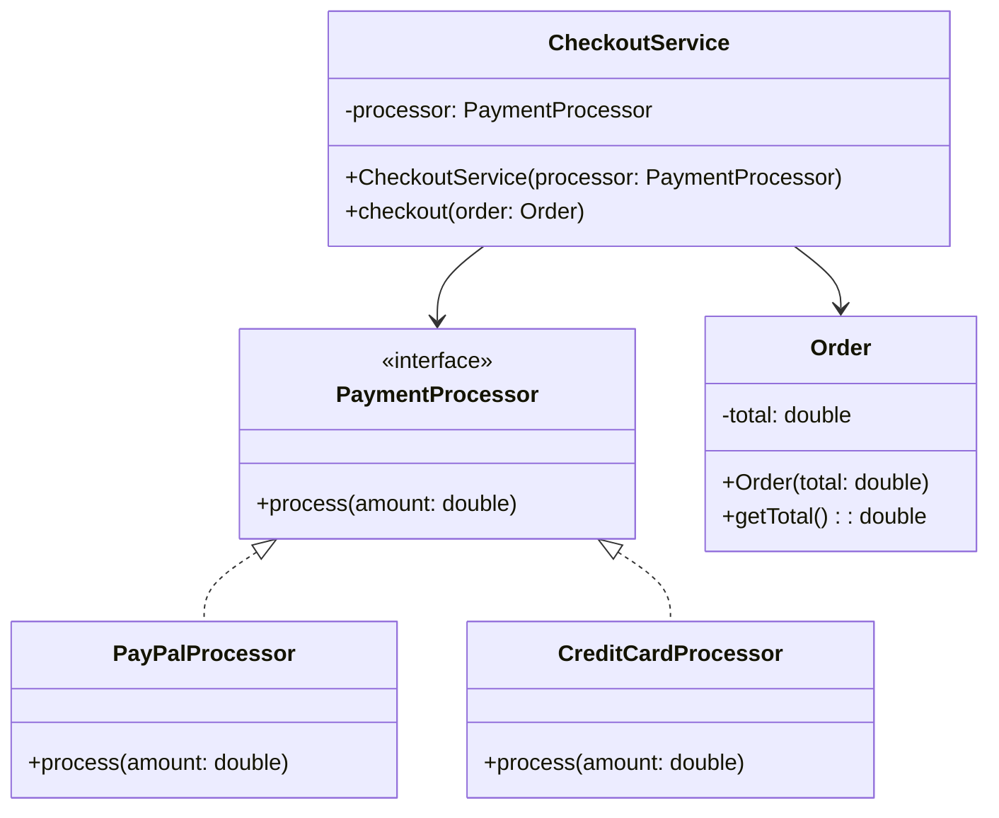

1. **S – Single Responsibility Principle (SRP)**
   Una clase debe tener una sola razón de cambio → hacer **una sola cosa**.

2. **O – Open/Closed Principle (OCP)**
   El código debe estar abierto a **extensión** pero cerrado a **modificación** → usar interfaces/herencia.

3. **L – Liskov Substitution Principle (LSP)**
   Una subclase debe poder **sustituir** a su superclase sin romper el programa.

4. **I – Interface Segregation Principle (ISP)**
   Mejor muchas interfaces **específicas** que una grande y genérica.

5. **D – Dependency Inversion Principle (DIP)**
   Las clases deben depender de **abstracciones**, no de implementaciones concretas.

---

## Ejemplo en Java aplicando SOLID



Supongamos un sistema para **procesar pagos**:

```java
// ISP + DIP → interfaces pequeñas y específicas
interface PaymentProcessor {
    void process(double amount);
}

// OCP + LSP → podemos extender con nuevos métodos de pago sin modificar lo existente
class PayPalProcessor implements PaymentProcessor {
    public void process(double amount) {
        System.out.println("Procesando pago con PayPal: $" + amount);
    }
}

class CreditCardProcessor implements PaymentProcessor {
    public void process(double amount) {
        System.out.println("Procesando pago con Tarjeta de Crédito: $" + amount);
    }
}

// SRP → clase con una única responsabilidad: manejar órdenes
class Order {
    private double total;

    public Order(double total) {
        this.total = total;
    }

    public double getTotal() {
        return total;
    }
}

// DIP → depende de la abstracción PaymentProcessor, no de una clase concreta
class CheckoutService {
    private PaymentProcessor processor;

    public CheckoutService(PaymentProcessor processor) {
        this.processor = processor;
    }

    public void checkout(Order order) {
        processor.process(order.getTotal());
    }
}

// MAIN
public class Main {
    public static void main(String[] args) {
        Order order = new Order(99.99);

        // Podemos usar cualquier implementación sin tocar CheckoutService (OCP + LSP + DIP)
        CheckoutService checkoutPayPal = new CheckoutService(new PayPalProcessor());
        checkoutPayPal.checkout(order);

        CheckoutService checkoutCard = new CheckoutService(new CreditCardProcessor());
        checkoutCard.checkout(order);
    }
}
```

---

Aquí aplicamos:

* **SRP:** `Order` solo maneja el pedido, `CheckoutService` solo checkout, `PaymentProcessor` solo procesar pago.
* **OCP:** si agregamos `BitcoinProcessor`, no modificamos código viejo.
* **LSP:** todas las subclases (`PayPalProcessor`, `CreditCardProcessor`) pueden sustituir a `PaymentProcessor`.
* **ISP:** interfaz pequeña, solo un método `process`.
* **DIP:** `CheckoutService` depende de la abstracción `PaymentProcessor`, no de clases concretas.
