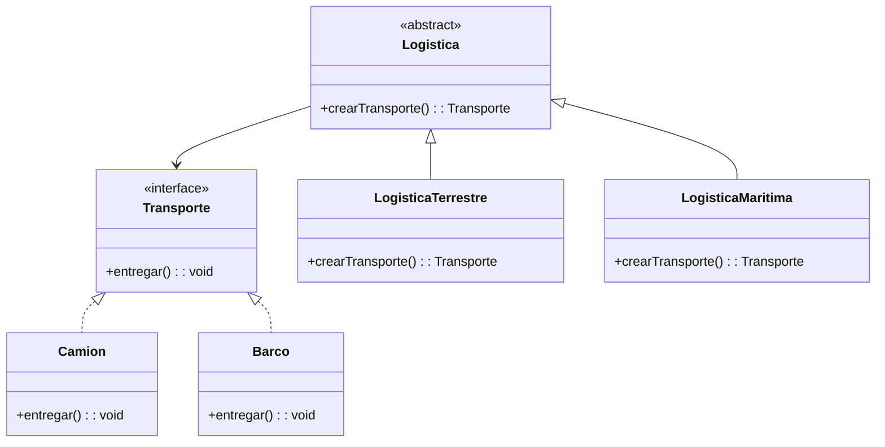

# Teoría
## Definición

El **Factory Method** (Método Fábrica o Constructor Virtual) es un **patrón de diseño creacional** que:

* Proporciona una interfaz común para crear objetos en una superclase.
* Permite que las subclases decidan qué clase concreta de objeto instanciar.
* Desacopla la lógica del cliente de la creación de objetos específicos.

---

## Problema

Si el código cliente está acoplado a clases concretas, cada vez que se quiera añadir un nuevo producto (por ejemplo, transporte terrestre, marítimo o aéreo), será necesario modificar varias partes del sistema. Esto genera código difícil de mantener y extender.

---

## Solución

* Definir una **interfaz de producto común** (ej. `Transporte`).
* Definir un **método fábrica** en una clase creadora (ej. `Logistica`) que devuelve productos de esa interfaz.
* Las subclases de la creadora implementan el método y devuelven un tipo específico (ej. `Camion`, `Barco`).

---

## Estructura (Mermaid UML)



---

## Cuándo usar

* Cuando el código debe **trabajar con una interfaz común** y no con implementaciones concretas.
* Cuando se espera que **la familia de productos crezca** en el futuro.

## Cuándo no usar

* Cuando el número de productos es pequeño y estable (es más simple usar constructores directos).
* Cuando la herencia genera sobrecarga innecesaria.

---

## Ejemplo en Spring Boot (Java)

```java
// Producto
public interface Transporte {
    void entregar();
}

// Productos concretos
public class Camion implements Transporte {
    @Override
    public void entregar() {
        System.out.println("Entrega por carretera en camión");
    }
}

public class Barco implements Transporte {
    @Override
    public void entregar() {
        System.out.println("Entrega por mar en barco");
    }
}

// Creador abstracto
public abstract class Logistica {
    public abstract Transporte crearTransporte();

    public void planEntrega() {
        Transporte transporte = crearTransporte();
        transporte.entregar();
    }
}

// Creadores concretos
public class LogisticaTerrestre extends Logistica {
    @Override
    public Transporte crearTransporte() {
        return new Camion();
    }
}

public class LogisticaMaritima extends Logistica {
    @Override
    public Transporte crearTransporte() {
        return new Barco();
    }
}

// Cliente (ejemplo de uso en un CommandLineRunner de Spring Boot)
@SpringBootApplication
public class FactoryMethodApp implements CommandLineRunner {
    public static void main(String[] args) {
        SpringApplication.run(FactoryMethodApp.class, args);
    }

    @Override
    public void run(String... args) {
        Logistica terrestre = new LogisticaTerrestre();
        terrestre.planEntrega();

        Logistica maritima = new LogisticaMaritima();
        maritima.planEntrega();
    }
}
```

---

## Ejemplo en Django (Python)

```python
from abc import ABC, abstractmethod

# Producto
class Transporte(ABC):
    @abstractmethod
    def entregar(self):
        pass

# Productos concretos
class Camion(Transporte):
    def entregar(self):
        return "Entrega por carretera en camión"

class Barco(Transporte):
    def entregar(self):
        return "Entrega por mar en barco"

# Creador abstracto
class Logistica(ABC):
    @abstractmethod
    def crear_transporte(self) -> Transporte:
        pass

    def plan_entrega(self):
        transporte = self.crear_transporte()
        return transporte.entregar()

# Creadores concretos
class LogisticaTerrestre(Logistica):
    def crear_transporte(self) -> Transporte:
        return Camion()

class LogisticaMaritima(Logistica):
    def crear_transporte(self) -> Transporte:
        return Barco()

# Uso en una vista de Django
from django.http import JsonResponse

def entrega_view(request, tipo):
    if tipo == "tierra":
        logistica = LogisticaTerrestre()
    elif tipo == "mar":
        logistica = LogisticaMaritima()
    else:
        return JsonResponse({"error": "Tipo de transporte no válido"}, status=400)

    return JsonResponse({"resultado": logistica.plan_entrega()})
```

---

## Resumen

* El **Factory Method** permite crear objetos sin acoplar el código cliente a clases concretas.
* Sigue los principios de **abierto/cerrado** y **responsabilidad única**.
* Es aplicable en frameworks como Spring Boot o Django para encapsular la creación de objetos dependientes del negocio.

# Práctica con Spring Boot

### Paso 1: Creación del Proyecto en IntelliJ IDEA 🚀

Primero, vamos a recrear el proyecto desde cero para tener una guía completa.

1.  Abre IntelliJ IDEA y ve a **File** \> **New** \> **Project...**.
2.  En la ventana que aparece, selecciona **Spring Initializr** en el panel izquierdo.
3.  Configura los metadatos de tu proyecto.
      * **Name**: `Factory-Method-Ejemplo`
      * **Location**: La carpeta donde quieras guardarlo.
      * **Language**: **Java**
      * **Type**: **Gradle - Groovy**
      * **Group**: `com.example.solid`
      * **Artifact**: `factorymethodejemplo`
      * **JDK**: Asegúrate de seleccionar la **versión 17** (o superior).
      * **Packaging**: **Jar**
4.  Haz clic en **Next**.
5.  Ahora, elige las dependencias. Para este proyecto, solo necesitas **Spring Web**.
6.  Haz clic en **Create**. IntelliJ generará la estructura del proyecto.

-----

### Paso 2: Estructura de Paquetes 📂

Una buena organización es clave. Dentro de `src/main/java/com/example/solid/factorymethodejemplo`, crearemos los siguientes paquetes para mantener nuestro código ordenado:

  * `transport`: Contendrá la interfaz del producto (`Transporte`) y sus implementaciones concretas (`Camion`, `Barco`).
  * `factory`: Contendrá la clase creadora abstracta (`Logistica`) y sus implementaciones concretas (`LogisticaTerrestre`, `LogisticaMaritima`).
  * `controller`: Contendrá nuestro `RestController`, que actuará como el cliente del patrón.

-----

### Paso 3: Codificación del Patrón Factory Method 🏭

Ahora vamos a escribir el código, siguiendo la estructura que definimos.

#### 3.1. Crear los Productos (Interfaz y Clases Concretas) 🚚

Dentro del paquete `transport`, crea estas tres clases.

**`Transporte.java` (La Interfaz del Producto)**

```java
package com.example.solid.factorymethodejemplo.transport;

public interface Transporte {
    String entregar();
}
```

**`Camion.java` (Producto Concreto)**

```java
package com.example.solid.factorymethodejemplo.transport;

import org.springframework.stereotype.Component;

@Component
public class Camion implements Transporte {
    @Override
    public String entregar() {
        return "Entrega por carretera en un camión.";
    }
}
```

**`Barco.java` (Producto Concreto)**

```java
package com.example.solid.factorymethodejemplo.transport;

import org.springframework.stereotype.Component;

@Component
public class Barco implements Transporte {
    @Override
    public String entregar() {
        return "Entrega por mar en un barco.";
    }
}
```

#### 3.2. Crear los Creadores (Clase Abstracta y Fábricas Concretas)

Ahora, en el paquete `factory`, crea la clase abstracta y las dos fábricas concretas.

**`Logistica.java` (El Creador Abstracto)**

```java
package com.example.solid.factorymethodejemplo.factory;

import com.example.solid.factorymethodejemplo.transport.Transporte;

public abstract class Logistica {

    // Este es el "Factory Method" que las subclases deben implementar
    public abstract Transporte crearTransporte();

    public String planificarEntrega() {
        Transporte transporte = crearTransporte();
        return transporte.entregar();
    }
}
```

**`LogisticaTerrestre.java` (Creador Concreto)**

```java
package com.example.solid.factorymethodejemplo.factory;

import com.example.solid.factorymethodejemplo.transport.Camion;
import com.example.solid.factorymethodejemplo.transport.Transporte;
import org.springframework.stereotype.Component;

@Component("terrestre") // Nombre clave para identificar esta fábrica
public class LogisticaTerrestre extends Logistica {
    @Override
    public Transporte crearTransporte() {
        return new Camion();
    }
}
```

**`LogisticaMaritima.java` (Creador Concreto)**

```java
package com.example.solid.factorymethodejemplo.factory;

import com.example.solid.factorymethodejemplo.transport.Barco;
import com.example.solid.factorymethodejemplo.transport.Transporte;
import org.springframework.stereotype.Component;

@Component("maritima") // Nombre clave para esta otra fábrica
public class LogisticaMaritima extends Logistica {
    @Override
    public Transporte crearTransporte() {
        return new Barco();
    }
}
```

-----

### Paso 4: Crear el Cliente (Controlador REST) 🌐

Finalmente, en el paquete `controller`, crearemos la clase que utiliza las fábricas para construir los productos. Usaremos la inyección de dependencias de Spring para que elija la fábrica correcta por nosotros.

**`LogisticaController.java`**

```java
package com.example.solid.factorymethodejemplo.controller;

import com.example.solid.factorymethodejemplo.factory.Logistica;
import org.springframework.beans.factory.annotation.Autowired;
import org.springframework.http.ResponseEntity;
import org.springframework.web.bind.annotation.GetMapping;
import org.springframework.web.bind.annotation.PathVariable;
import org.springframework.web.bind.annotation.RequestMapping;
import org.springframework.web.bind.annotation.RestController;

import java.util.Map;
import java.util.Optional;

@RestController
@RequestMapping("/api/logistica")
public class LogisticaController {

    // Spring inyecta un mapa con todas las fábricas. La clave es el nombre
    // que pusimos en @Component ("terrestre", "maritima").
    private final Map<String, Logistica> logisticaMap;

    @Autowired
    public LogisticaController(Map<String, Logistica> logisticaMap) {
        this.logisticaMap = logisticaMap;
    }

    @GetMapping("/entrega/{tipo}")
    public ResponseEntity<String> realizarEntrega(@PathVariable String tipo) {
        // Buscamos la fábrica correcta según el "tipo" de la URL.
        return Optional.ofNullable(logisticaMap.get(tipo))
                .map(logistica -> {
                    // Si la encontramos, planificamos la entrega.
                    // El controlador no sabe qué tipo de transporte se está creando.
                    String resultado = logistica.planificarEntrega();
                    return ResponseEntity.ok(resultado);
                })
                .orElse(ResponseEntity.badRequest().body("Tipo de logística no válido: " + tipo));
    }
}
```

-----

### Paso 5: Probar la Aplicación ✅

¡Todo está listo\!

1.  Ejecuta tu aplicación desde la clase principal `FactoryMethodEjemploApplication`.
2.  Usa un navegador para probar los siguientes endpoints:

<!-- end list -->

  * **Para la entrega terrestre:**
    `http://localhost:8080/api/logistica/entrega/terrestre`

    **Respuesta esperada:**

    ```
    Entrega por carretera en un camión.
    ```

  * **Para la entrega marítima:**
    `http://localhost:8080/api/logistica/entrega/maritima`

    **Respuesta esperada:**

    ```
    Entrega por mar en un barco.
    ```

  * **Para un tipo no existente:**
    `http://localhost:8080/api/logistica/entrega/aerea`

    **Respuesta esperada:**

    ```
    Tipo de logística no válido: aerea
    ```

# Práctica con Django

### Paso 1: Creación del Proyecto en PyCharm 🚀

Primero, vamos a crear un proyecto Django nuevo y limpio.

1.  Abre PyCharm (la versión Professional es ideal para esto) y ve a **File** \> **New** \> **Project...**.
2.  En la ventana que aparece, selecciona **Django** en el panel izquierdo.
3.  Configura tu proyecto:
      * **Location**: Elige una carpeta y nombra el proyecto, por ejemplo, `factory_method_django`.
      * **New environment using**: Selecciona **Virtualenv**. Esto creará un entorno virtual aislado para tu proyecto, lo cual es una práctica recomendada en Python.
      * **Application name**: Puedes nombrar tu primera aplicación, por ejemplo, `core`.
4.  Haz clic en **Create**. PyCharm configurará el entorno, instalará Django y generará la estructura básica del proyecto.

-----

### Paso 2: Estructura de Archivos y Aplicación Django 📂

En Django, la lógica se organiza en "apps". Crearemos una app específica para nuestra funcionalidad de logística.

Antes te recomiendo instalar en una terminal
```
pip install django
pip lis 
```

1.  Abre la terminal dentro de PyCharm (**View** \> **Tool Windows** \> **Terminal**).
2.  Ejecuta el siguiente comando para crear una nueva app llamada `logistica`:
    ```bash
    python manage.py startapp logistica
    ```
3.  Ahora, debemos registrar esta nueva app en nuestro proyecto. Abre el archivo `factory_method_django/settings.py` y añade `'logistica'` a la lista de `INSTALLED_APPS`:
    ```python
    # factory_method_django/settings.py

    INSTALLED_APPS = [
        # ... otras apps
        'django.contrib.staticfiles',
        'logistica', # Añade tu app aquí
    ]
    ```

Dentro de la carpeta `logistica`, organizaremos nuestro patrón en diferentes archivos para mayor claridad: `products.py`, `factories.py`, y modificaremos `views.py`.

-----

### Paso 3: Codificación del Patrón Factory Method 🏭

Ahora vamos a escribir el código Python. Usaremos el módulo `abc` para crear clases abstractas, el equivalente a las interfaces de Java para este caso.

#### 3.1. Crear los Productos (Clase Abstracta y Concretas) 🚚

1.  Dentro de la carpeta `logistica`, crea un nuevo archivo llamado `products.py`.
2.  Añade el siguiente código:

**`logistica/products.py`**

```python
from abc import ABC, abstractmethod

# La clase abstracta base (equivalente a la interfaz)
class Transporte(ABC):
    @abstractmethod
    def entregar(self) -> str:
        pass

# Producto Concreto
class Camion(Transporte):
    def entregar(self) -> str:
        return "Entrega por carretera en un camión."

# Producto Concreto
class Barco(Transporte):
    def entregar(self) -> str:
        return "Entrega por mar en un barco."
```

#### 3.2. Crear los Creadores (Clase Abstracta y Fábricas Concretas)

1.  Dentro de la carpeta `logistica`, crea otro archivo nuevo llamado `factories.py`.
2.  Añade el siguiente código:

**`logistica/factories.py`**

```python
from abc import ABC, abstractmethod
from .products import Transporte, Camion, Barco

# El Creador Abstracto
class Logistica(ABC):
    # Este es el "Factory Method"
    @abstractmethod
    def crear_transporte(self) -> Transporte:
        pass

    def planificar_entrega(self) -> str:
        transporte = self.crear_transporte()
        return transporte.entregar()

# Creador Concreto
class LogisticaTerrestre(Logistica):
    def crear_transporte(self) -> Transporte:
        return Camion()

# Creador Concreto
class LogisticaMaritima(Logistica):
    def crear_transporte(self) -> Transporte:
        return Barco()
```

-----

### Paso 4: Crear el Cliente (La Vista de Django) 🌐

El "cliente" en Django será una vista que recibe la petición HTTP, elige la fábrica correcta y devuelve una respuesta.

Modifica el archivo `logistica/views.py` que se creó automáticamente.

**`logistica/views.py`**

```python
from django.http import JsonResponse
from .factories import Logistica, LogisticaTerrestre, LogisticaMaritima

# Un mapa para registrar nuestras fábricas.
# Esto nos permite añadir nuevas fábricas sin tocar esta vista.
FABRICAS_DISPONIBLES = {
    "terrestre": LogisticaTerrestre,
    "maritima": LogisticaMaritima,
}

def realizar_entrega(request, tipo: str):
    """
    Esta vista actúa como el cliente del patrón Factory Method.
    """
    # 1. Busca la clase de la fábrica correcta en nuestro mapa.
    fabrica_class = FABRICAS_DISPONIBLES.get(tipo)

    if not fabrica_class:
        return JsonResponse({"error": f"Tipo de logística no válido: {tipo}"}, status=400)

    # 2. Instancia la fábrica seleccionada.
    fabrica: Logistica = fabrica_class()

    # 3. Usa la fábrica para planificar la entrega, sin saber qué producto se crea.
    resultado = fabrica.planificar_entrega()

    return JsonResponse({"mensaje": resultado})
```

-----

### Paso 5: Configurar las URLs 🔗

Necesitamos decirle a Django qué URL debe activar nuestra vista.

1.  Dentro de la carpeta `logistica`, crea un nuevo archivo `urls.py`.
    **`logistica/urls.py`**

    ```python
    from django.urls import path
    from . import views

    urlpatterns = [
        path('entrega/<str:tipo>/', views.realizar_entrega, name='realizar_entrega'),
    ]
    ```

2.  Ahora, incluye estas URLs en el archivo principal de URLs del proyecto.
    **`factory_method_django/urls.py`**

    ```python
    from django.contrib import admin
    from django.urls import path, include # Asegúrate de importar "include"

    urlpatterns = [
        path('admin/', admin.site.urls),
        # Añade esta línea para conectar las URLs de tu app
        path('api/logistica/', include('logistica.urls')),
    ]
    ```

-----

### Paso 6: Probar la Aplicación ✅

¡Todo está configurado\!

1.  En la terminal de PyCharm, ejecuta el servidor de desarrollo de Django:
    ```bash
    python manage.py runserver
    ```
2.  Usa un navegador o `curl` para probar los siguientes endpoints:

<!-- end list -->

  * **Para la entrega terrestre:**
    `http://127.0.0.1:8000/api/logistica/entrega/terrestre/`

    **Respuesta esperada (JSON):**

    ```json
    {
        "mensaje": "Entrega por carretera en un camión."
    }
    ```

  * **Para la entrega marítima:**
    `http://127.0.0.1:8000/api/logistica/entrega/maritima/`

    **Respuesta esperada (JSON):**

    ```json
    {
        "mensaje": "Entrega por mar en un barco."
    }
    ```

  * **Para un tipo no existente:**
    `http://127.0.0.1:8000/api/logistica/entrega/aerea/`

    **Respuesta esperada (JSON con código 400):**

    ```json
    {
        "error": "Tipo de logística no válido: aerea"
    }
    ```

Con estos pasos, has implementado exitosamente el patrón Factory Method en un proyecto Django, manteniendo tu código desacoplado y listo para expandirse con nuevos tipos de transporte sin necesidad de modificar la lógica del cliente.