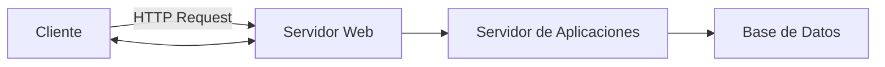

28/Ago/2025
# Componentes y Arquitectura de Aplicaciones Web

Cuando hablamos de aplicaciones web, el primer concepto que aparece es **HTTP** (*HyperText Transfer Protocol*). HTTP es el protocolo que permite la comunicación entre los **clientes** (navegadores como Chrome, Firefox, Safari o Edge) y los **servidores web**. Es importante destacar que HTTP es **sin estado** (*stateless*): cada petición se procesa de manera independiente, lo que significa que el servidor no “recuerda” lo que ocurrió en peticiones anteriores. Por ello, para manejar sesiones de usuario se requieren mecanismos adicionales como **cookies**, **login con usuario y contraseña** o **tokens**.

---

## Servidores Web y su importancia

Para que HTTP funcione, necesitamos un **servidor web**. Este software recibe las peticiones, las procesa y devuelve respuestas. Entre los servidores más comunes encontramos:

* **Nginx**: el más usado actualmente por su eficiencia, modularidad y bajo consumo de recursos.
* **Apache**: muy extendido, estable y ampliamente documentado.
* **IIS (Internet Information Services)**: servidor de Microsoft, exclusivo para entornos Windows.
* **Tomcat**: especializado en aplicaciones Java (servlets, JSP).

Históricamente también existieron otros como NCSA, pero hoy en día los más relevantes son Apache y Nginx.

Los servidores no solo entregan páginas, también pueden actuar como **proxy inverso**, balanceadores de carga o gestionar conexiones seguras con **HTTPS**.

---

## Stacks de desarrollo

Un **stack** es el conjunto de tecnologías que se combinan para crear una aplicación web. Los más conocidos son:

* **LAMP**: Linux, Apache, MySQL/MariaDB, PHP (o Python/Perl).
* **WAMP**: igual que LAMP pero en Windows.

Estos stacks permiten integrar el sistema operativo, el servidor web, el lenguaje de programación y el gestor de base de datos (SGBD).

---

## Bases de datos y persistencia

Las aplicaciones web generalmente requieren almacenar información. Para esto se usan **Sistemas de Gestión de Bases de Datos (SGBD)** como:

* **Oracle** (robusto, orientado a grandes empresas).
* **PostgreSQL** (open-source, potente y muy flexible).
* **SQLite** (ligero, ideal para aplicaciones pequeñas o locales).

En muchos casos, **SQLite** puede ser suficiente si se combina con un servidor eficiente, pero en proyectos grandes se opta por soluciones más escalables.

---

## Arquitectura en tres capas

La mayoría de aplicaciones web siguen un modelo de **tres capas**:

1. **Cliente (navegador):** presenta la interfaz al usuario.
2. **Servidor de aplicaciones:** maneja la lógica, frameworks y validaciones.
3. **Base de datos:** almacena y organiza la información.

Esto se suele representar así:

---

## Estado y sesiones

Como HTTP es **stateless**, necesitamos mecanismos externos para mantener el estado de la aplicación. Ejemplos:

* **Cookies**: pequeñas piezas de información que viajan entre cliente y servidor.
* **Sesiones con login y password**: guardadas en el servidor.
* **Tokens (JWT, OAuth, etc.)**: permiten autenticación distribuida.

Sin estos mecanismos, el servidor no sabría si dos peticiones provienen del mismo usuario.

---

## Estándares y RFC

Todos los protocolos de Internet, incluyendo HTTP, están definidos en documentos llamados **RFC (Request For Comments)**.

* **HTTP/1.1**: RFC 7230 y relacionados.
* **HTTP/2**: RFC 7540.
* **HTTP/3**: RFC 9114, basado en QUIC (sobre UDP).

Conocer la RFC que define la versión de HTTP que usamos nos permite entender las capacidades y limitaciones del protocolo.

---

## Limitaciones de HTTP

HTTP fue diseñado para entregar documentos (HTML, imágenes, CSS). Por eso no es ideal para flujos en tiempo real como videollamadas. Tecnologías modernas como **WebRTC** permiten superar esa limitación, ofreciendo transmisión de audio y video en navegadores (ejemplo: Google Meet).

---

## Otros conceptos importantes

* **Cluster**: conjunto de servidores trabajando en paralelo para soportar más usuarios o garantizar disponibilidad.
* **Profiling**: análisis del rendimiento de una aplicación para encontrar cuellos de botella y optimizarla.

---

# Ejemplo General

Supongamos que queremos crear una aplicación web de **búsqueda de libros**:

1. El usuario abre el navegador (cliente) e ingresa una URL.
2. El navegador envía una petición **HTTP GET** al servidor web (ej. Nginx).
3. El servidor web reenvía la solicitud al **servidor de aplicaciones** (ej. un framework en Python como Django o en Java con Tomcat).
4. El servidor consulta la **base de datos** (ej. PostgreSQL) para obtener la lista de libros.
5. El servidor genera una respuesta (HTML/JSON) y la envía de vuelta al cliente.
6. El navegador muestra la lista al usuario.
7. Si el usuario inicia sesión, el sistema guarda un **token** o **cookie** para mantenerlo identificado en futuras peticiones.

---

# Glosario

| Término               | Definición                                                                              |
| --------------------- | --------------------------------------------------------------------------------------- |
| **HTTP**              | Protocolo de comunicación usado en la web, sin estado.                                  |
| **HTTPS**             | Versión segura de HTTP con cifrado TLS/SSL.                                             |
| **Servidor web**      | Software que recibe peticiones HTTP y devuelve respuestas (ej. Apache, Nginx).          |
| **Stack (LAMP/WAMP)** | Conjunto de tecnologías para crear aplicaciones web.                                    |
| **SGBD**              | Sistema de Gestión de Bases de Datos; administra el almacenamiento y consulta de datos. |
| **Cluster**           | Conjunto de servidores que trabajan como si fueran uno solo.                            |
| **Profiling**         | Análisis del rendimiento de una aplicación para optimización.                           |
| **RFC**               | Documentos oficiales que definen estándares de Internet.                                |

