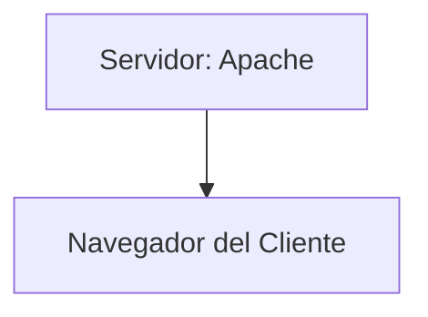

01/Sep/2025
## 1. Lenguajes interpretados

Los lenguajes interpretados (como **PHP, Python o Java**) funcionan mediante una **máquina virtual o un intérprete**, que ejecuta el código línea por línea en tiempo real.

* Antes de ejecutarse, el código pasa por un análisis léxico y semántico.
* El intérprete se encarga de administrar la memoria, por lo que el programador no suele preocuparse por esta tarea.
* Gracias a esta abstracción, el mismo código puede ejecutarse en diferentes plataformas siempre que exista un intérprete o máquina virtual disponible.

Ejemplo en **Java**:

```
Programa.java → compilado en .class → empaquetado en .jar → ejecutado en la JVM (Java Virtual Machine)
```

La máquina virtual corre sobre una **plataforma** (conjunto de hardware + sistema operativo).

* Ejemplo de plataformas:

  * Hardware: Intel, AMD, ARM, MIPS, RISC-V.
  * Sistemas operativos: Windows, Linux, macOS.

**Multiplataforma** significa que un mismo programa puede correr en distintos sistemas operativos y arquitecturas de hardware, gracias al intérprete o VM.

⚠️ En una máquina virtual existen restricciones: no podemos acceder directamente a la memoria RAM o al hardware, lo cual protege al sistema.

---

## 2. ¿Dónde se ejecutan estos lenguajes?

* **Servidor (backend):** PHP, Python, Java.
* **Cliente (frontend):** JavaScript.

Ejemplo gráfico:



En algunos casos antiguos, tecnologías como **ActiveX** permitían al navegador acceder a recursos del sistema (RAM, discos, periféricos). Esto “rompía” el aislamiento de seguridad, por lo que se consideraba riesgoso.

---

## 3. Herramientas de desarrollo

* **Editor:** solo permite escribir y editar texto (ejemplo: Notepad++, Vim).
* **IDE (Entorno de Desarrollo Integrado):** además de editar, integra herramientas para compilar, ejecutar, probar solicitudes HTTP (GET/POST), depurar y administrar bases de datos.

Un IDE puede conectarse al **esquema de una base de datos**, lo que permite ver relaciones, índices y estructuras internas.

---

## 4. Control del flujo en programación

* **Estructuras de control (ciclos):** permiten repetir procesos (`for`, `while`, `do while`).
* **Estructuras de selección (condicionales):** permiten decidir rutas de ejecución (`if`, `else`). También se usan para manejar **excepciones** (errores al consultar una base de datos, errores de ejecución, etc.).

---

## 5. Paso por valor vs paso por referencia

Ejemplo:

```python
def sumar(x, y):
    return x + y

sumar(3, 4)
```

* **Paso por valor:** se clona el contenido de la variable, y al terminar se libera. El valor original no se modifica.
* **Paso por referencia:** se pasa la dirección de memoria, lo que permite modificar el valor original.

En la mayoría de máquinas virtuales, los parámetros se pasan **por valor** para evitar accesos directos al sistema.

Los **lenguajes compilados** (como C/C++) sí permiten paso por referencia real, ya que generan ejecutables (`.exe`, `.out`) que interactúan directamente con la memoria y el hardware.

---

## 6. Lenguajes compilados vs interpretados

* **Lenguajes compilados:** generan un binario que corre directamente en la plataforma (ej: C, C++). Permiten mayor control de memoria y acceso a periféricos.
* **Lenguajes interpretados:** requieren un intérprete o VM (ej: Python, Java, PHP). No tienen acceso directo al hardware, pero ofrecen portabilidad y facilidad de uso.

Ejemplo:

* **Java:** corre en la JVM, que solo accede a periféricos básicos (teclado, mouse, pantalla). Por eso, en entornos como puntos de venta, no se suele usar.
* **Python:** rápido y versátil, aunque algunos paquetes deben compilarse para usar hardware especializado (ej: tarjetas gráficas).

---

## 7. Frameworks

Los frameworks permiten acelerar el desarrollo siguiendo patrones establecidos.

* **Lado cliente:** frameworks de JavaScript (React, Angular, Vue).
* **Lado servidor:** frameworks de Python (Django, Flask) o Java (Spring).

Es importante:

* Investigar en bases de datos de vulnerabilidades (**CVE**) la seguridad del framework que usamos.
* Evaluar su comunidad, soporte y documentación.
* Evitar frameworks inseguros o abandonados.

---

## Glosario

| Término                                        | Definición                                                                                                            |
| ---------------------------------------------- | --------------------------------------------------------------------------------------------------------------------- |
| **Intérprete**                                 | Programa que traduce y ejecuta código fuente línea por línea en tiempo real.                                          |
| **Máquina Virtual (VM)**                       | Entorno que simula una computadora dentro de otra. Ejecuta programas de forma controlada y segura.                    |
| **Multiplataforma**                            | Capacidad de un programa de ejecutarse en distintos sistemas operativos y arquitecturas de hardware.                  |
| **Backend**                                    | Parte del sistema que corre en el servidor y maneja lógica, datos y seguridad.                                        |
| **Frontend**                                   | Parte de la aplicación que corre en el navegador y que interactúa con el usuario.                                     |
| **ActiveX**                                    | Tecnología de Microsoft que permitía a los navegadores acceder directamente al hardware. Fue abandonada por insegura. |
| **IDE**                                        | Entorno de Desarrollo Integrado: editor de código + compilador/intérprete + depurador + herramientas extra.           |
| **CVE (Common Vulnerabilities and Exposures)** | Base de datos pública donde se registran fallos de seguridad conocidos en software y frameworks.                      |
