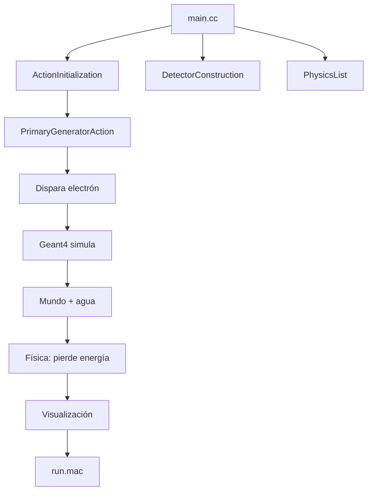

En este escrito, se pretende el desarrollo de un proyecto desde cero con Geant4, para entender la estructura de directorios, archivos y flujo de los mismos, siendo un punto de partida, para proyectos más complejos.

## 1. Prerrequisitos

- **Geant4 instalado**: Asegúrate de que Geant4 está instalado y configurado (puedes usar conda). Puedes verificar ejecutando:
```bash
geant4-config --version
```

  Esto debería mostrar la versión instalada (por ejemplo, `geant4-11-03-patch-02`).
- **ROOT instalado** (opcional, para análisis de datos): Verifica con:
```bash
root --version
```

- **CMake**: Necesario para compilar el proyecto. Verifica con:
```bash
cmake --version
```

- Un compilador C++ (como `g++` o `clang`).
- Un editor de texto (como VSCode, nano, o cualquier IDE).

| Herramienta         | Comando de verificación   |
| ------------------- | ------------------------- |
| **Geant4**          | `geant4-config --version` |
| **ROOT** (opcional) | `root --version`          |
| **CMake**           | `cmake --version`         |
| **Compilador C++**  | `g++ --version`           |
| **Editor**          | VSCode, CLion, nano       |


>[! Importante]
>En esta versión, dado que las computadoras ya tienen muchos núcleos, se usará una clase `ActionInitialization`, en versiones anteriores no era necesaria.

---

## 2. Estructura del proyecto

Crearemos un proyecto llamado `SimpleG4` con una simulación básica: un electrón incide sobre un bloque de agua, y registraremos la energía depositada. La estructura será:

```
SimpleG4/
├── include/
│   ├── DetectorConstruction.hh
│   ├── PhysicsList.hh
│   ├── PrimaryGeneratorAction.hh
│   ├── ActionInitialization.hh        
├── src/
│   ├── DetectorConstruction.cc
│   ├── PhysicsList.cc
│   ├── PrimaryGeneratorAction.cc
│   ├── ActionInitialization.cc         
├── CMakeLists.txt
├── main.cc
├── run.mac                             <- VISUALIZACIÓN AUTOMÁTICA
```

---


## 3. Crear el proyecto

```bash
mkdir SimpleG4 && cd SimpleG4
mkdir include src build
```


> [! Tip]
> **Recomendación**: Usa **CLion** para mejor integración con CMake. 

---

## 4. Código Completo con Explicación
En esta parte te diré lo que hace cada parte del código, así como una serie de analogías conocidas.

### **`CMakeLists.txt` – El "Jefe de Obra"**

Este archivo configura la compilación con CMake. Crea `CMakeLists.txt` en la raíz del proyecto.

**CMakeLists.txt** es el "planos de construcción" que hace posible compilar proyectos complejos de C++ de manera organizada y eficiente; si no estuviera todo el proceso de compilación se tendría que hacer comando por comando en la termina.

```cmake
cmake_minimum_required(VERSION 3.10)
project(SimpleG4)

# Busca Geant4 con visualización
find_package(Geant4 REQUIRED ui_all vis_all)
include(${Geant4_USE_FILE})

# ROOT (opcional)
find_package(ROOT)
if(ROOT_FOUND)
    include(${ROOT_USE_FILE})
    add_definitions(-DWITH_ROOT)
endif()

# Fuentes y cabeceras
file(GLOB sources ${PROJECT_SOURCE_DIR}/src/*.cc)
file(GLOB headers ${PROJECT_SOURCE_DIR}/include/*.hh)

# Crea ejecutable
add_executable(simpleG4 main.cc ${sources} ${headers})
target_include_directories(simpleG4 PRIVATE ${PROJECT_SOURCE_DIR}/include)
target_link_libraries(simpleG4 PRIVATE ${Geant4_LIBRARIES} ${ROOT_LIBRARIES})

# Copia run.mac al build/
set(SCRIPTS run.mac)
foreach(_script ${SCRIPTS})
    configure_file(${PROJECT_SOURCE_DIR}/${_script} ${PROJECT_BINARY_DIR}/${_script} COPYONLY)
endforeach()
```

> **¿Qué hace?**  
> - Busca Geant4  
> - Compila todos los `.cc`  
> - Crea `simpleG4`  
> - Copia `run.mac`

---

### **`main.cc` – El "Director de Orquesta"**
Este es el punto de entrada del programa. Crea `main.cc` en la raíz:

```cpp
#include "G4RunManagerFactory.hh"
#include "G4UImanager.hh"
#include "G4VisExecutive.hh"
#include "G4UIExecutive.hh"

#include "DetectorConstruction.hh"
#include "PhysicsList.hh"
#include "ActionInitialization.hh"

int main(int argc, char** argv) {
    // Modo multi-hilo
    auto* runManager = G4RunManagerFactory::CreateRunManager(G4RunManagerType::MT);

    // Inicializa clases
    runManager->SetUserInitialization(new DetectorConstruction());
    runManager->SetUserInitialization(new PhysicsList());
    runManager->SetUserInitialization(new ActionInitialization());

    runManager->Initialize();

    // Visualización
    auto* visManager = new G4VisExecutive();
    visManager->Initialize();

    // UI (lo que tiene que hacer )
    auto* UImanager = G4UImanager::GetUIpointer();

    if (argc == 1) {
        auto* ui = new G4UIExecutive(argc, argv);
        UImanager->ApplyCommand("/control/execute run.mac");
        ui->SessionStart();
        delete ui;
    } else {
        G4String command = "/control/execute ";
        UImanager->ApplyCommand(command + argv[1]);
    }

    delete visManager;
    delete runManager;
    return 0;
}
```

> **¿Qué hace?**  
> - Inicia Geant4 en **modo multi-hilo**  
> - Llama a los 3 constructores  
> - Abre ventana gráfica  
> - Ejecuta `run.mac`

---

### **`include/ActionInitialization.hh` – El "Capataz de Hilos"**

```cpp
#ifndef ACTION_INITIALIZATION_HH
#define ACTION_INITIALIZATION_HH

#include "G4VUserActionInitialization.hh"

class ActionInitialization : public G4VUserActionInitialization {
public:
    ActionInitialization();
    ~ActionInitialization() override;

    void BuildForMaster() const override;
    void Build() const override;
};

#endif
```

> **¿Qué hace?**  
> - Define una clase que **coordina acciones por hilo**

---

### **`src/ActionInitialization.cc`**

```cpp
#include "ActionInitialization.hh"
#include "PrimaryGeneratorAction.hh"

ActionInitialization::ActionInitialization() = default;
ActionInitialization::~ActionInitialization() = default;

void ActionInitialization::BuildForMaster() const {
    // Hilo maestro (opcional)
}

void ActionInitialization::Build() const {
    SetUserAction(new PrimaryGeneratorAction());  // Crea pistola por hilo
}
```

> **¿Qué hace?**  
> - **Crea una `PrimaryGeneratorAction` por cada hilo**  
> - Evita el error `G4Exception: Run0123`

---

### **`include/PrimaryGeneratorAction.hh` – La "Pistola"** o sea quien dispará.
Define la fuente de partículas. Crea este archivo en `include/`:

```cpp
#ifndef PRIMARY_GENERATOR_ACTION_HH
#define PRIMARY_GENERATOR_ACTION_HH

#include "G4VUserPrimaryGeneratorAction.hh"
#include "G4ParticleGun.hh"

class PrimaryGeneratorAction : public G4VUserPrimaryGeneratorAction {
public:
    PrimaryGeneratorAction();
    ~PrimaryGeneratorAction() override;
    void GeneratePrimaries(G4Event*) override;

private:
    G4ParticleGun* fParticleGun = nullptr;
};

#endif
```

> **¿Qué hace?**  
> - Define una clase que **dispara partículas**

---

### **`src/PrimaryGeneratorAction.cc`**
Configura un electrón como partícula inicial. Crea este archivo en `src/`:

```cpp
#include "PrimaryGeneratorAction.hh"
#include "G4ParticleTable.hh"
#include "G4SystemOfUnits.hh"

PrimaryGeneratorAction::PrimaryGeneratorAction() {
    fParticleGun = new G4ParticleGun(1);
    auto* particle = G4ParticleTable::GetParticleTable()->FindParticle("e-");
    if (!particle) {
        G4cerr << "ERROR: Partícula 'e-' no encontrada!\n";
        return;
    }
    fParticleGun->SetParticleDefinition(particle);
    fParticleGun->SetParticleEnergy(1.0 * MeV);
    fParticleGun->SetParticlePosition(G4ThreeVector(0, 0, -20*cm));
    fParticleGun->SetParticleMomentumDirection(G4ThreeVector(0, 0, 1));
}

PrimaryGeneratorAction::~PrimaryGeneratorAction() { delete fParticleGun; }

void PrimaryGeneratorAction::GeneratePrimaries(G4Event* event) {
    fParticleGun->GeneratePrimaryVertex(event);  // ¡DISPARA!
}
```

> **¿Qué hace?**  
> - Crea un **electrón de 1 MeV**  
> - Lo coloca en **z = -20 cm**  
> - Lo dispara hacia **+z**

---

### **`include/DetectorConstruction.hh` – El "Arquitecto"**
Define la geometría de la simulación (un cubo de agua en un mundo de aire). Crea este archivo en `include/`:

```cpp
#ifndef DETECTOR_CONSTRUCTION_HH
#define DETECTOR_CONSTRUCTION_HH

#include "G4VUserDetectorConstruction.hh"
#include "G4LogicalVolume.hh"

class DetectorConstruction : public G4VUserDetectorConstruction {
public:
    DetectorConstruction();
    ~DetectorConstruction() override;
    G4VPhysicalVolume* Construct() override;

private:
    G4LogicalVolume* fLogicTarget = nullptr;
};

#endif
```

> **¿Qué hace?**  
> - Define la **geometría del mundo**

---

### **`src/DetectorConstruction.cc`**
Implementa la geometría. Crea este archivo en `src/`:

```cpp
#include "DetectorConstruction.hh"
#include "G4Box.hh"
#include "G4LogicalVolume.hh"
#include "G4PVPlacement.hh"
#include "G4NistManager.hh"
#include "G4SystemOfUnits.hh"

DetectorConstruction::DetectorConstruction() = default;
DetectorConstruction::~DetectorConstruction() = default;

G4VPhysicalVolume* DetectorConstruction::Construct() {
    auto* nist = G4NistManager::Instance();
    auto* air = nist->FindOrBuildMaterial("G4_AIR");
    auto* water = nist->FindOrBuildMaterial("G4_WATER");

    // Mundo
    G4double worldSize = 1.0 * m;
    auto* worldSolid = new G4Box("World", worldSize/2, worldSize/2, worldSize/2);
    auto* worldLV = new G4LogicalVolume(worldSolid, air, "World");
    auto* worldPV = new G4PVPlacement(nullptr, {}, worldLV, "World", nullptr, false, 0);

    // Blanco
    G4double targetSize = 10.0 * cm;
    auto* targetSolid = new G4Box("Target", targetSize/2, targetSize/2, targetSize/2);
    fLogicTarget = new G4LogicalVolume(targetSolid, water, "Target");
    new G4PVPlacement(nullptr, {}, fLogicTarget, "Target", worldLV, false, 0);

    return worldPV;
}
```

> **¿Qué hace?**  
> - Crea un **mundo de 1 m³ de aire**  
> - Coloca un **cubo de 10 cm de agua** en el centro

---

### **`include/PhysicsList.hh` – El "Físico"**
Define los procesos físicos. Crea este archivo en `include/`:

```cpp
#ifndef PHYSICS_LIST_HH
#define PHYSICS_LIST_HH

#include "G4VModularPhysicsList.hh"

class PhysicsList : public G4VModularPhysicsList {
public:
    PhysicsList();
    ~PhysicsList() override;
};

#endif
```

> **¿Qué hace?**  
> - Define las **leyes físicas**

---

### **`src/PhysicsList.cc`**
Usa una lista de física predefinida para simplificar. Crea este archivo en `src/`:

```cpp
#include "PhysicsList.hh"
#include "G4EmStandardPhysics.hh"

PhysicsList::PhysicsList() {
    RegisterPhysics(new G4EmStandardPhysics());
}

PhysicsList::~PhysicsList() = default;
```

> **¿Qué hace?**  
> - Usa **física electromagnética estándar**  
> - El electrón pierde energía en el agua

---

### **`run.mac` – El "Guion de la Película"**

#### Configuración Simple con Visor

Define comandos para ejecutar la simulación. Crea este archivo en la raíz:

Una versión simple para que ejecute solo la simulación, es
```
/run/initialize
/run/beamOn 100
/vis/open OGLIQt 800x600-0+0
```

>[! Nota]
>La línea 3, aunque no es obligatoria, se recomienda para poder acceder a la librería OpenGL de nuestra gráfica, si presentas problemas al ver o "parpadeos", consulta el modelo de tu gráfica, y de su librería.


==Si te vas al paso 5 desde este punto obtendrás esto:==


La ventana que aparece es el **visor interactivo de Geant4** (usando OpenGL o Qt, dependiendo de la configuración).  
Actualmente muestra:

- El **árbol de comandos** a la izquierda (`/control`, `/run`, `/vis`, etc.)
- El **panel de salida** abajo con los logs de la simulación
- El **área de visualización** en blanco (porque **aún no has dibujado nada**)
  
> No hay geometría visible porque **no se ha ejecutado ningún comando de visualización**.

---

   PASO 1: Abre un visor OpenGL
En la **consola de Geant4** (abajo en la ventana), escribe:

```bash
/vis/open OGLIQt 600x600-0+0
```

Esto abre un visor OpenGL de 600x600 píxeles.

---

PASO 2: Configura la vista
```bash
/vis/viewer/set/viewpointVector -1 0.5 0.5
/vis/viewer/set/lightsVector -1 0.5 0.5
/vis/viewer/zoom 1.5
```

Esto ajusta la cámara para ver bien (más adelante) el mundo y el blanco.


---

PASO 3: Dibuja la geometría
```bash
/vis/drawVolume
```


Ahora se configura:
- Un **cubo grande (mundo de aire)**
- Un **cubo pequeño en el centro (blanco de agua)**

---

PASO 4: Configura las trayectorias
```bash
/vis/scene/add/trajectories smooth
/vis/modeling/trajectories/create/drawByCharge
/vis/modeling/trajectories/drawByCharge-0/default/setDrawStepPts true
/vis/modeling/trajectories/drawByCharge-0/default/setStepPtsSize 2
```

Esto dibuja las trayectorias de partículas con puntos en cada paso.

---

PASO 5: Ejecuta eventos
```bash
/run/beamOn 50
```


Ahora verás:
- 50 electrones disparados desde `z = -20 cm`
- Interaccionando con el **blanco de agua**
- Generando **trayectorias visibles** (electrones, fotones, etc.)

---


#### Configuración Automatizada con Visor

En este caso, inicia el visor, pero sin acciones, si queremos que, nos haga todo lo anterior de forma automatizada.

```
# === run.mac ===  
  
# 1. Inicializar  
/run/initialize  
  
# 2. Abrir visor  
/vis/open OGLIQt 800x600-0+0  
  
# 3. Dibujar geometría  
/vis/drawVolume  
  
# 4. Configurar vista  
/vis/viewer/set/viewpointVector -1 0.5 0.5  
/vis/viewer/zoom 1.8  
/vis/viewer/set/style surface  
  
# 5. Agregar trayectorias  
/vis/scene/add/trajectories smooth  
  
# 6. Crear modelo  
/vis/modeling/trajectories/create/drawByCharge  
  
# 7. CONFIGURAR (¡CORREGIDO!)  
/vis/modeling/trajectories/drawByCharge-0/default/setDrawStepPts true  
/vis/modeling/trajectories/drawByCharge-0/default/setStepPtsSize 2  
  
# 8. Ejecutar  
/run/beamOn 100
```

> **¿Qué hace?**  
> - Abre ventana OpenGL  
> - Dibuja geometría  
> - Muestra trayectorias  
> - Dispara 100 electrones


¿Qué deberías ver ahora?

| Elemento | Descripción |
|--------|-----------|
| **Cubo grande (azul/transparent)** | Mundo lleno de aire (`G4_AIR`) |
| **Cubo pequeño (azul más oscuro)** | Blanco de agua (`G4_WATER`) |
| **Líneas amarillas/rojas** | Trayectorias de electrones y fotones |
| **Puntos verdes** | Puntos de interacción (pasos) |

| Comando | Función |
|-------|--------|
| `/vis/viewer/refresh` | Refresca la vista |
| `/vis/viewer/reset` | Reinicia cámara |
| `/vis/scene/add/axes 0 0 0 10 cm` | Agrega ejes de referencia |
| `/vis/scene/add/scale 10 cm` | Agrega regla de 10 cm |
| `/tracking/verbose 1` | Muestra pasos detallados en consola |
| `/run/beamOn 1` | Ejecuta solo 1 evento (útil para depurar) |

#### Extras

Agrega color al blanco de agua:

```
/vis/geometry/set/colour Target 0 0 0.7 1 0.5
```
(azul translúcido)

O haz el mundo invisible:
```
/vis/geometry/set/visibility World 0 false
```


## 5. Compilar y ejecutar

```bash
cd build
cmake ..
make -j$(nproc)
./simpleG4        # → Ventana + 100 electrones
```

>[! Note]
>En la línea 3; `make -j$(nproc)` es para usar todos los núcleos al compilar, sin embargo puedes usar de forma indistinta con `make`, solo que el primero es más rápido, y el segundo más "lento".


---

<a name="6-visualización-automática"></a>
## 6. Visualización automática

| Elemento | Qué ves |
|--------|--------|
| Cubo grande | Mundo de aire |
| Cubo azul | Blanco de agua |
| Rayos amarillos | Electrones |
| Puntos verdes | Interacciones |

---

## 7. Flujo de Geant4 (paso a paso)



---

## 9. Resumen visual

| Archivo                  | Rol          | Analogía              |
| ------------------------ | ------------ | --------------------- |
| `main.cc`                | Director     | Inicia todo           |
| `ActionInitialization`   | Capataz      | Coordina hilos        |
| `PrimaryGeneratorAction` | Pistola      | Dispara electrones    |
| `DetectorConstruction`   | Arquitecto   | Construye mundo       |
| `PhysicsList`            | Físico       | Define leyes          |
| `CMakeLists.txt`         | Jefe de obra | Compila               |
| `run.mac`                | Guion        | Muestra visualización |

---

## ¡Listo!

Se ha creado un proyecto Geant4 **completo, funcional y visual** desde cero.

**Próximos pasos**:
1. **Crear más ejemplos** resolviendo problemas del mundo real.
2. **Dividir el `.mac`** para una mejor configuración.
3. **Agregar `TargetSD` + ROOT** → guarda energía
4. **Crear `EventAction`** → suma por evento
5. **Analizar con ROOT**


